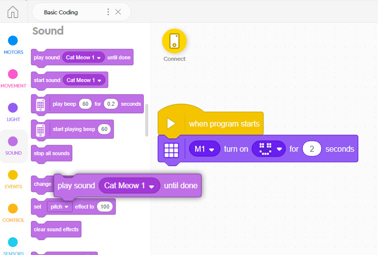
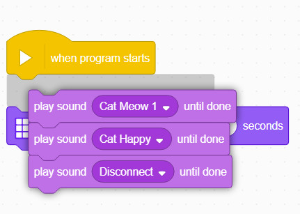
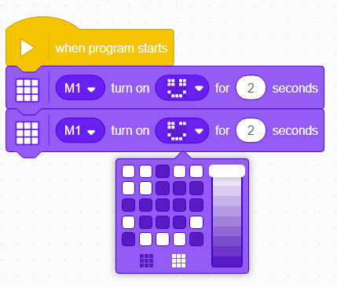
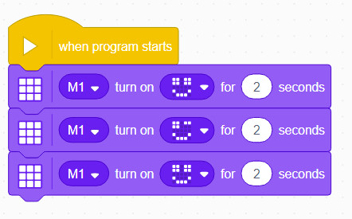
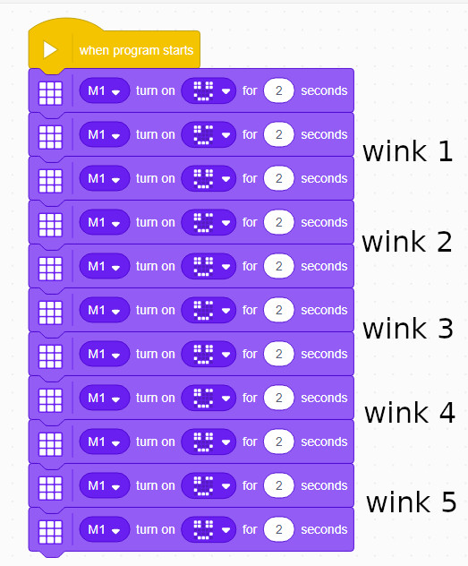
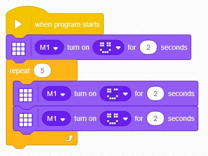
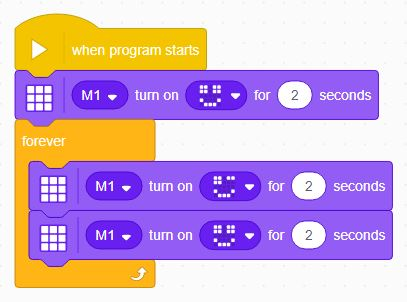

Loops 
---

Now that you've played a bit with statments and sequences, we can introduce another fundamental coding concept - the **loop**.

Loops are used to **execute a patten of statements** more than once, without having to reprogram the sequences.

Let's look at an example.

## Delete & Reorder Statements

Before we go much further we wanted to say a word about deleting and reordering coding statements in these World Blocks projects.

If you need to **delete** any blocks, you can just **drag** them back to the blocks tabs.  

If you want to **reorder** blocks, just note that whenever you **grab** a statement you are grabbing it and everything attached **below** it... 

It takes some getting used to, but you will soon get the hang of it!

## The Wink

Let's try to make our Hub give us a wink.

A wink means you close one eye and then open it back up.

If we start with a smiley face, we can add another block to close the right eye.

Then we will add another block to re-open that eye:

*HINT: If you think the winks are too slow you can reduce the time for each image.*

But, what if I want to write a program that will wink 5 times?

When one first starts coding, the inclination is always to copy and paste the sequences:

But we can simplify (rationalize, in software engineering terminology) this code to repeat the wink pattern.

## Repeat

You will find various Loop blocks under the **Control** blocks tab.  

The most common Loop block to use is the **Repeat []** block.  

Any sequences you add inside the Repeat block will be executed in sequence the amount of times you indicate, for instance:

If you wish for the animation to last forever, you can replace the **Repeat** block with a **Forever** block:

## Challenge

Can you try and come up with another type of animation that you can loop over and over again?

Some ideas:

- A beating heart (big, small, big, small)
- A dot bouncing along the screen
- A rocket shooting up 
- A square pattern building up from one corner...
