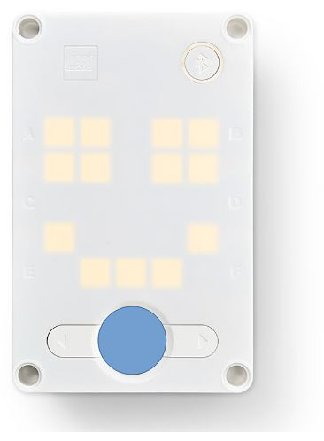
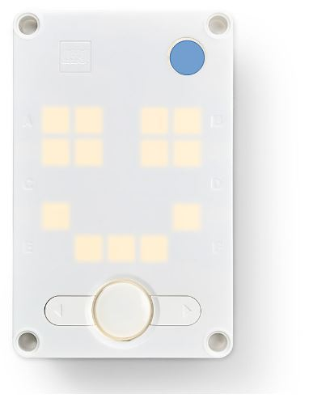
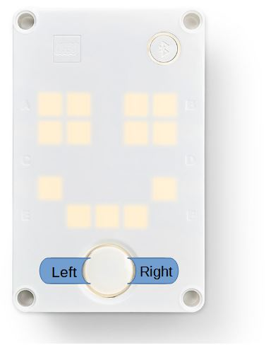
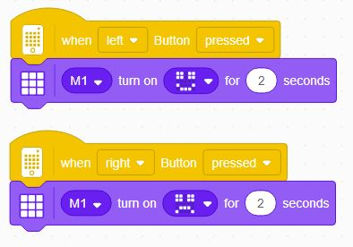
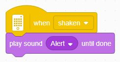
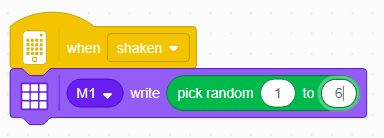
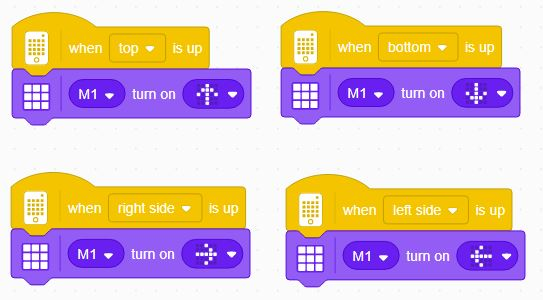

Events
---

Now that we know how to create basic code sequences with repeated patterns, let's learn about a way to trigger different sequences, called **Events**.

Events are a way to trap something that happens and then trigger some program execution.

We already used one type of event - **when program starts**.

But there are many other ones, for instance when the user clicks a button.

## Spike Hub Buttons

You've already used the Spike Hub **Power/Home** button:

And maybe the **Bluetooth** button:

But, there are **two direction buttons** as well, and we can use them to control events.

## When Button Pressed Event

So let's make a program with the following logic:

- When the **Left** button is pressed, show a **smiley** face
- When the **Right** button is pressed, show a **sad** face

Find the correct Event block under the Events blocks tab, and add the appropriate Light block, e.g:

## Challenge: Other Events

Look at some of the other events.

Some events have to do with external sensors (color, limit switch/push-button, ultrasonic) - we will deal with those later.

Others have to do with the Hub itself and its internal sensors, so let's start with exploring some of those now:

- When Shaken (easy)
    - Make a program that sounds an alert whenever it's shaken
  
- When Shaken (medium)
    - Make a Random Dice that shows a number between 1 and 6 when the Hub is shaken (use Operators tab to find a block that generates random numbers)
  
- When [Hub Face] is up (hard)
    - Make a program that shows an arrow pointing "up" no matter which way you're holding the Hub.
 

And think of ways to use these:

- When [loudness/timer]
- When Tilted [direction]

Some solutions to the above challenges can be found below...

Try to program on your own first, and only look when you give up!

- 
- 
-
-
-
-
-
-
-
-
-
-
-
-
-
-
-
-
-

**When Shaken (easy):**

-
-
-
-
-
-
-
-
-

**When Shaken (medium):**

-
-
-
-
-
-
-
-
-

**When [Hub Face] is up (hard)**

