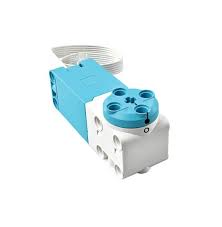
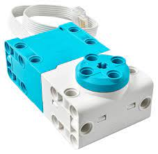
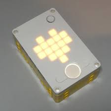
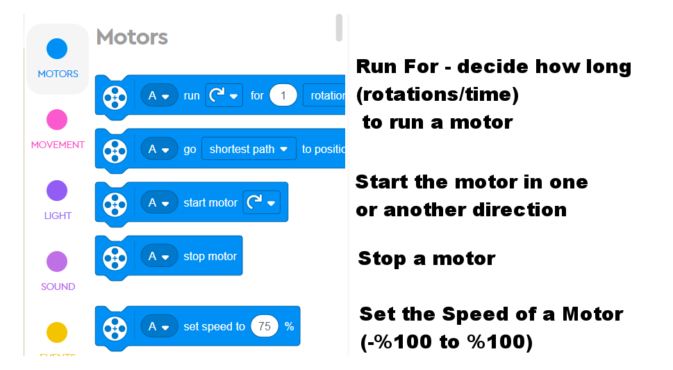
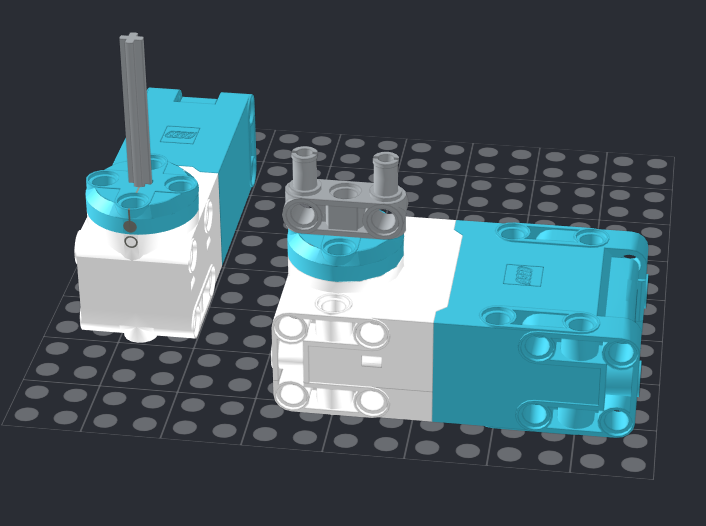

Basic Motor Control
---

Before we make a 2-wheel robot, we should learn how a single motor works, and how to program it.

What can we make with just 1 motor?

* Vehicles that can drive only forwards and backwards

    * Motorcycles
    * Trains
    * Motor boats & cars (?)

* Catapults
* Construction cranes
* Drills
* Coveyor belts
* Hammers
* Sprinkler head
* Merry-Go-Round
* Ceiling fan
* and more...

We have two types of motors:

Medium

 
 

Large

## Connecting Motors

Motors can connect to any of the six Spike Hub ports.

Once connected the motors can be tested by turning on the Spike Hub, and running the HEART program (scroll using Left & Right buttons until you see the HEART, then press the large ON button to run).

Use the LEFT and RIGHT buttons to increase/decrease speeds in both directions.

Let's test it out!

## Coding Motors

## Make LEGOs Move!

Build any mobile contraption you want by adding an axle to the motor shaft, or by hooking up connectors to the off-center motor holes:

* Build a **motorized project** that can be interacted with

* Code your motors to spin in both directions (3 seconds forward, 3 seconds backwards, in a loop) to animate it. 

* You can also add sound & lights using what we've learned.

* You can also experiment with programming various speeds.

    * For insatnce, a merry-go-round starts out slow and gains momentum, eventually hitting a top speed, and then slowing down at a pace until coming to a complete stop.

* You can also use the Heart program, or make your own Remote Control using the Left/Right buttons and their relevant events for control.