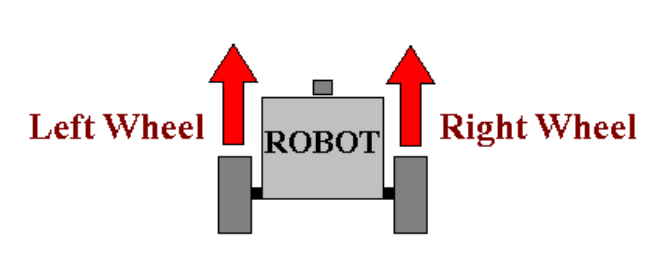
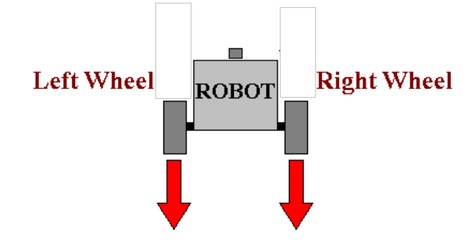
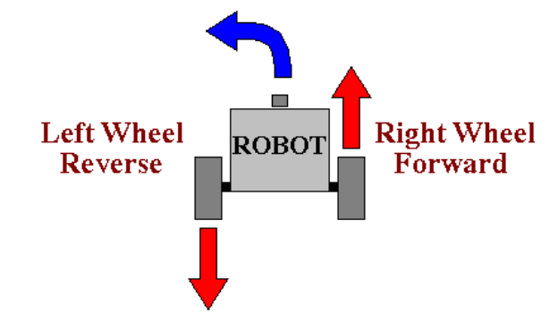
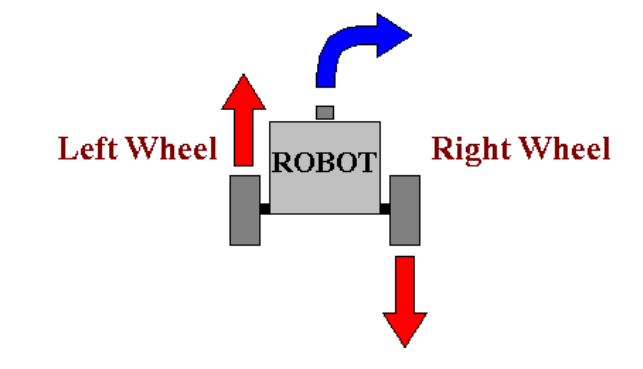
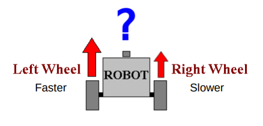
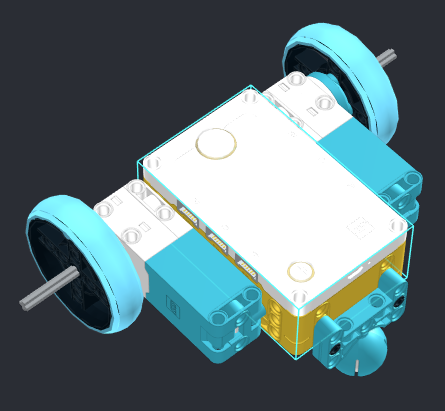
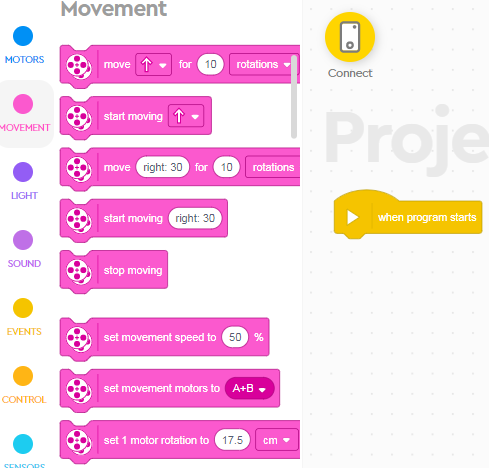

Two Wheel Robots
---

Now that we understand some basic Motor Control, let's look at how Two-Wheel Robots behave.

This is how classic car steering works.

One motor is driving the back axle, and the passive front wheels are used for steering:

Robots don't need a steering wheel.  
And it's much easier to maneuver if you have two independent motors, like a tank.

Here's an example of modern mobile robots:

<iframe width="640" height="360" src="https://www.youtube.com/embed/FBl4Y55V2Z4" title="YouTube video player" frameborder="0" allow="accelerometer; autoplay; clipboard-write; encrypted-media; gyroscope; picture-in-picture" allowfullscreen></iframe>

## Simple Movements

So, how do we control simple, two-wheel robots?

Need to drive both motors at the same speed to go forward:

Also, need to use the same speed on both motors to go back:

What about turning?

Lot's of ways to turn, but themost efficient approach is:

What about when we want to turn the other way?

How about this?

What are some other possibilities we have not discussed?
Let's test some movement on our LEGO robots.

## Basic Build

First we need to build a robot with two motors driving a wheel on each side, and balanced, usually over a ball bearing.

Here is the basic idea, but please feel free to build a more interesting design:

Once built let's test some Movement Blocks:

## Move For vs. Start Moving

The **Move For** tell the robot to use the 2 motors in a particular direction for a certain distance or for a certain duration.

These are great for robots with *planned paths*.

However, most modern mobile robots are designed to work in dynamic environments - where things might move into their paths and they can't just drive over them!

For more interesting algorithms, we will be useing the **Start Moving** blocks, but for now, let's concentrate on sequential programming.

## Challenges

### Drive Straight 

Get your robot to drive forward for 1 meter, 1 tile, the length of the class, etc.

You can use either of the **Move For** blocks.

* By the way, what is the difference?  (one can turn, the other only for fwd/back)

## Turning

The Second **Move For** Block allows for turning:

Directions:

* 0 - Straight
* 100 - Sharpest Right turn possible (in place)
* ~50 - Wider turn radius
* ~5 - Very wide turn radius, this will trace a large circle on the floor

Negative numbers will behave the same, but towards the **left**.

Test out turning.

### Turning Challenges

* Trace a 30cm-radius circle
* Turn 90 degrees to the left
* Trace a square pattern
* Trace any other polygon