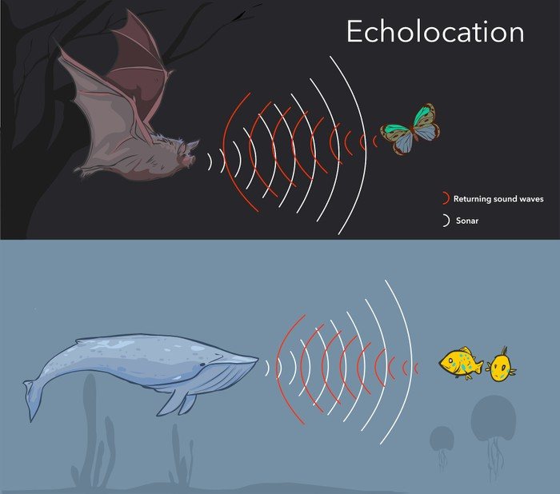
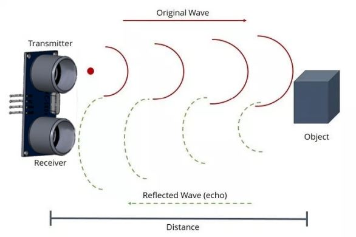
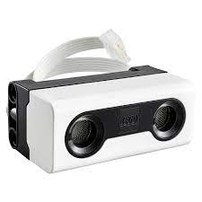
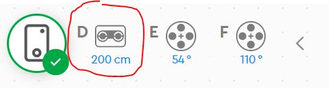
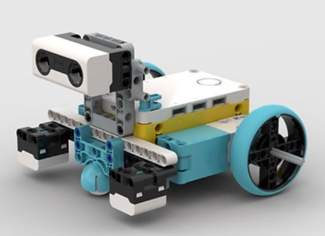

Ultrasonic Sensor
---

The ultrasonic sensor uses sound waves beyond the human hearing range to sense solid objects.

Its functinality is similar to biological echolocation in bats and certain marine mammals.

## How the Sensor Works

An ultrasonic sensor has a transmitter and a receiver.  Sometimes it looks like eyes, which can be confusing.

## Testing the Sensor

Let's test our Ultrasonic sensor - find and plug the sensor into the hub:

Once connected, look at the Sensor reading displayed at the top of your coding area:

Mount the sensor on your 2-Wheel robot and test the measurement as the robot nears a wall/obstacle.

- How close is too close?  
- What range of readings should we avoid altogether if we want to avoid walls?

## Programming Tips

We will be programming some robot behaviors that depend on the Ultrasonic sensor.  You can use the condition boolean for Ultrasonic sensor:

When you program algorithms you need to account for unpredictable outcomes - the environment of operation could change, an object might move into your path, etc.

So we usually do not use MOVEMENT blocks with pre-defined distances.

For instance, in our last challenge we may have used:

But now we will also need to use unspecific blocks like:

THis block tells the robot to start moving straight until further notice...

We will also need to account for variability in the programs, so we will need to use blocks that wait for some trigger:

(you might wish to use conditionals like If/Else but with the following challenges, those are not really necessary)

When a program requires you to repeat the same behavior over and over, you can use the Forever block:

## Challenges

- Go / Stop: Program the robot to drive straight until it sees a wall

- Roomba: Program the robot to turn away from walls, but continue driving straight forever, turning away from any obstacle

- Fun Parade: Program several robots to go straight forever, and only stop while they see an obstacle.  Then put them in a line, like a parade.  Use your body or another robot to be the parade leader! 