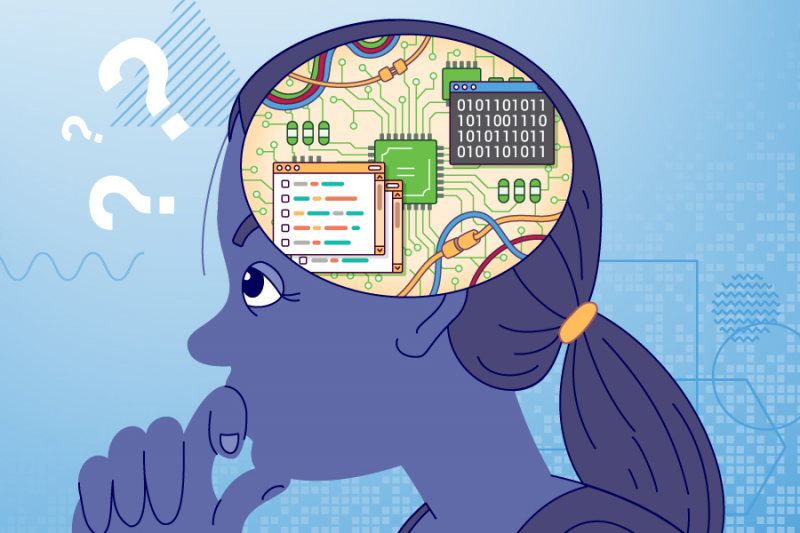
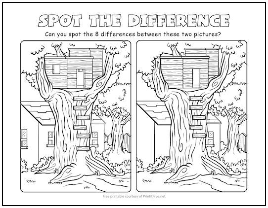
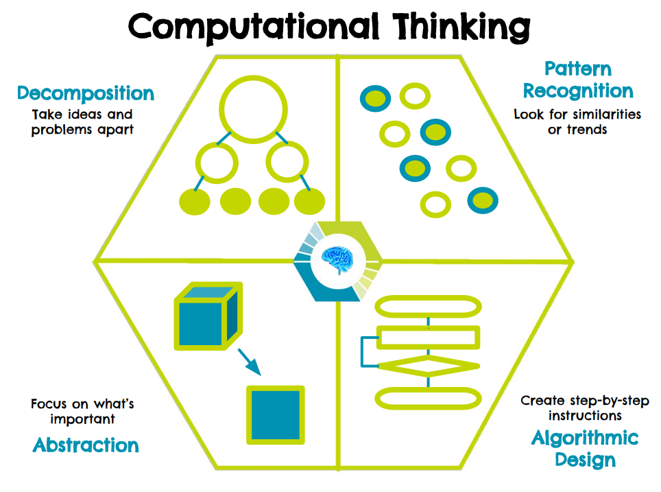

Computational Thinking
---

This program is built around the idea of Computational Thinking, which is a 21st Century Competency buzz phrase all students must recognize!

But what does it mean?

## What is Computational Thinking?

When people want to create calculators, computers, robots, and video games they need to think like a machine!  

- What should my iPad do when I turn it on?  
- What if I touch the screen where that icon is?

Machines like iPads don't think quite like humans.  They don't get distracted!  They don't care who is touching them.  They are designed to do a few things really well, and they never do anything unexpected - except when they GLITCH!

So if we want to be good at understanding how our modern world works, we better be good at thinking like a machine, too!  

Hence, Computational Thinking.

Machines are pretty bad still at some type of human thinking, but can be really good at some things that people can also be really good at, and much better than people at other ways of "thinking".

Four Computational Thinking skills that machines and humans can be quite good at:

- **Breaking down complex problems into smaller pieces**
  - Imagine a complex math problem like 12 x 3 + 17 - 54 / 9!
- **Planning and following our plans** 
  -  Someone wrote LEGO instructions, you followed it and made an awesome thing!
- **Pattern Recognition** (machines are finally catching up)
  - Noticing when things are alike or very different
- **Ignoring details that are not relevant to our current task or problem**
  - We don't need to know how an iPad works to use it!

  We use these skills every day, but we don't necessarily know we are doing it.

For instance, can you solve this?

 - Break it down: Don't have to find all 8 things all at once! Look for each difference one at a time!

 - Pattern Recognition: we immediately see a tree, a tree house, a ladder, a house behind... 

 - Ignore unnecessary details: don't have to look at every leaf squiggle to see the ladder or window...

 - Plan: I start by just seeing things pop out at me!  but when I get desperate for the last 2 differences, I start scanning the image, from the bottom then a bit higher, then higher, then higher....

We will come back to this idea, when we discuss different activities in coding and designing our robot!

 