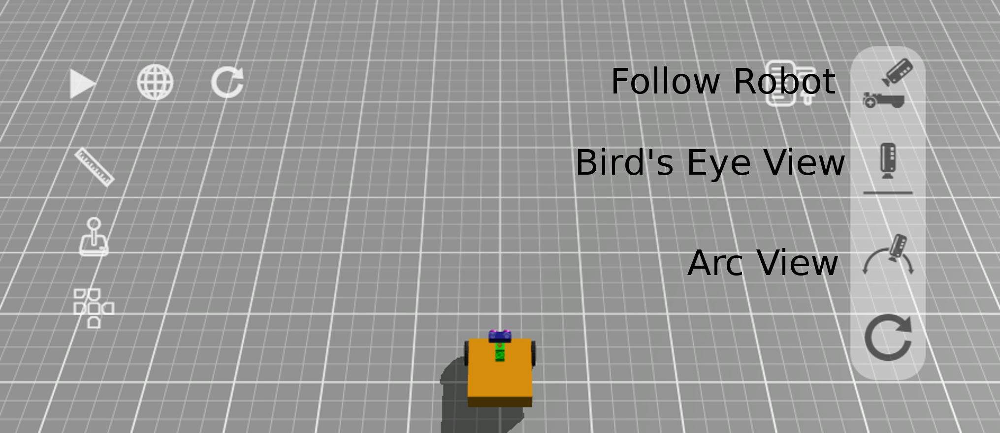

The GearsBot App
---

The GearsBot app was developed by Cort Wee of A Posteriori in Singapore during COVID lockdowns in 2020-2021.

The project is completely open-source, and has been contributed to by many other developers in the past few years, and used freely by an active and enthusiastic community all over the world.

The GearsBot base robot Single Line Follower and the coding blocks available are generally inspired by LEGO Mindstorms, as is the python API, which is based on EV3 third-party contributions.

The **Blocks** tab is where you code using block-based programming.
The **Python** tab is where you code using Python and either the ev3dev or pybricks APIs.
The **Simulator** tab is where the robot runs are simulated in a virtual, but physics-based world.

At the time of writing, the GearsBot platforms supports the basic building block shapes: **box, sphere, and cylinder**

It supports the following set of Sensors:

- Color
- Ultrasonic
- Gyro
- Touch
- Laser Range
- GPS

The first four are also supported by the LEGO Mindstorms platform.

It supports the following set of Actuators:

- Arm (box attached to a pivot point around which it rotates)
- Swivel (cylinder that rotates around a center point)
- Linear (box that moves in one dimension between two endpoints)
- Paintball Launcher (does pretty much what it says...)
- Magnet (electromagnet - turns on its magnetic force programatically)
- Wheel (a Swivel actuator that specifically controls a LEGO-like wheel on an invisible shaft)

## Blocks

On your PC/Laptop or Tablet you will need to open a web browser, like Chrome, and navigate to http://a9i.sg/gears or https://gears.aposteriori.com.sg.

### Starting Out

The app starts with the Blocks tab open.  You can navigate to the Simulator tab just to see the current world and robot selected.  By default, GearsBot starts with the **Grid Map** and the **Single Sensor Line Follower** robot.

### Camera

The Camera control is very useful.  You can look at the world and the robot from many different angles, you can find issues with new world you create.  You can zoom in or pan to a particular part of the world or the robot.

In short get comfortable with the various camera options and view controls.

- **Follow Robot**: camera keeps moving with robot.  You can use the left mouse button to change the camera position around the center view of the robot itself.

- **Bird's Eye View**: camera is placed orthogonally above the robot and mat.  Use the left mouse button to pan.

- **Arc View**: Anchor the camera wherever you want to keep a specific viewpoint as the robot moves around the world.  Use the left mouse button to change the rotation of the viewpoint, and the right button to pan.

- **Reset Camera** just changes back to default (Follow Robot) view.

Mouse wheel can be used to zoom in and out in all three views.

### Manual Control

Use manual control to make the robot drive around.
It's not quite like driving a car.
For one we have a differential drive system, with **each wheel moving independently**.  

Click on the Joystick and use the mouse/touch or arrow keys to move the robot around.

### Port View

Now open the Port View and drive up to a wall, all the while looking at the changes in the sensor readings.  Specifically, you should concentrate on the ultrasonic sensor, and the wheels (left & right motors).

Reset the world/simulation, to zero the the motor positions to get an idea of how far a degree or 360 degrees of wheel rotations get your robot.

<video autoplay muted loop width=100% height="auto">
  <source src="images/portview.mp4" type="video/mp4">
</video>

Now let's begin coding the robot movement...