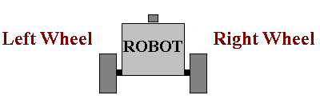
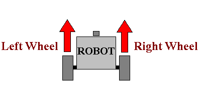
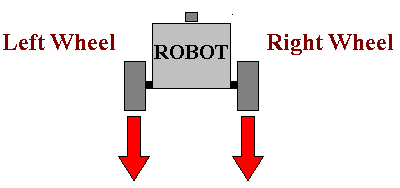
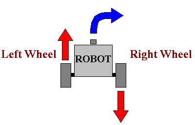

2-Wheel Robots
---

The most common robotic platforms in use today for industrial, commmercial and educational purposes are **2-Wheel Differentiated-Drive** robots.

**2 Wheels** just means they are moving by rotating two wheels.  While normal cars use 4 wheels, most cars are 2-wheel drive (2WD) and the other 2 wheels are just for support...

Moreover, in normal cars one engine is usually powering 2 or 4 wheels because their transmissions are connected.  The steering is handled via rotating the wheels along a second dimension.  

**Differentiated Drive** means that each wheel is controlled by a different, independent motor.  And the steering is handled by controlling each wheel separately.

For instance, rotating one wheel forward, and the second wheel backwards would cause a car to rotate about the center between those two wheels.

Here is an example of 2-wheel wharehouse robots:

<iframe width="640" height="360" src="https://www.youtube.com/embed/FBl4Y55V2Z4" title="YouTube video player" frameborder="0" allow="accelerometer; autoplay; clipboard-write; encrypted-media; gyroscope; picture-in-picture" allowfullscreen></iframe>

The Roomba, various robots deployed to Hawker centers and food courts are all built on similar principles.

Usually, you will have 2 motors each rotating a wheel or tire that are aligned next to one another.

Depending on wheel placement, you will also need one or more caster wheels or ball bearings to just balance the rest of the frame, like this:

## Forward

To move forward, you need to rotate both tires forward at the same speed:

---

## Back

To move forward, you need to rotate both tires back at the same speed:

---

## Right

To turn in either direction you will need to vary the direction and/or speeds of the two motors.

For instance to turn right, you can rotate the left tire forward and the right tire backward at the same speed:

---
## Left

Similarly, to turn left, you reverse and rotate left tire back, and right tire forward.
  

