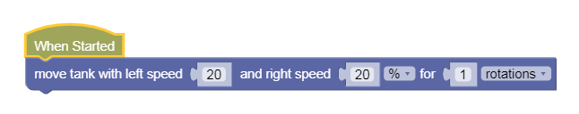

Sequences
---

Let's find out about Sequential programs in [GearsBot](https://gears.aposteriori.com.sg/).

## Blocks Tab

Navigate to the Blocks tab.
Notice the categories of code blocks on the left-hand side.

Whenever you click on any of those categories, a panel of relevant code blocks is shown.

You can drag and drop blocks from those panels into the coding canvas.

## When Started

The main program will start executing code from the **When Started** event.  When you press the **Run** button in the simulator, this is where the robot code begins.

## Statements

The fundamental unit of a code is an execution **statement**.  

Do this.  

Do that.  

When we program a bunch of these statements one after the other, the hub will execute them in the same order.  

This is called a **sequence**, meaning one statement follows another.

## Sequences

Let's try some simple code sequences.

First, let's make the robot **move forward**.

### Robot Movement

We already covered how to make the robot move in various ways using a differential 2-wheel drive, so let's get straight to coding.

Find the **Motion** tab, the first one, and look at the various choices... It may seem daunting.

We will only use the 2nd block - **Move tank For ___**

We will discuss all the other blocks in due time, but for now it should suffice to use this one block.

### Forward

Let's make the robot move 1 block forward.

Drag a Move Tank (2nd block) into When Started:

Now go back out to **Simulation** tab and click **Run**.

Your robot should move forward.

How far is it moving forward?  

However far 1 rotation of the wheels gets you - which is the circumference of the wheel.  The bigger the wheel the further you'd go...

Also, 1 Rotation = 360 degrees.  

If you want to go less than 1 rotation, change the distance unit to degrees.  For instance, to go half as far, use 180 degrees.

If you know your fractions and decimals, 180 degree is 0.5, or half of a full rotation.

**Challenges:**

- Change the speeds to go slower or faster, but remember to keep them the same speeds on both sides to go forward

- Make your robot go backward.  What numbers do you think would make your robot reverse?  (yes, negatives!)

- Try to write a simple program that make the robot go back and forth, back and forth over and over!

<video autoplay muted loop width=450 height="auto">
  <source src="images/backandforth.mp4" type="video/mp4">
</video>

## Test 

- Load [this version of GearsBot](https://quirkycort.github.io/gears/public/index.html?worldScripts=world_challenges)

- Select World: *Challenges*

- Select *Basic: Move*

- Follow instructions and note down the *special Code* after doing the challenge successfully!

