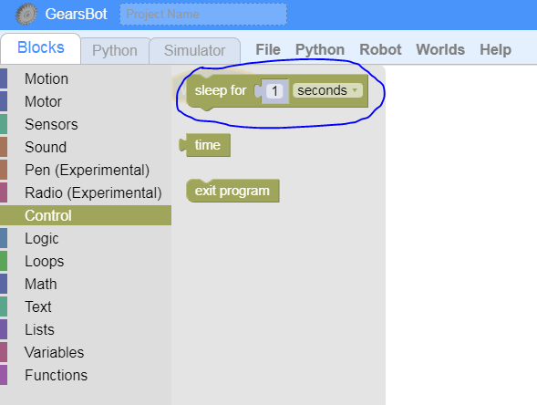

Pause, Sleep, Rest
---

Sequential programs sometimes require that your robot take a break, pausing for some other actions.

It's like standing at a red light.

In order to tell your robot to take a break, you need to pause the sequential operation for some time.

## Sleep Block

The *Sleep Block* under the *Control* Blocks category will do just that.

**Challenges:**

- Go back and forth like before, but add a 1 second stop between each direction

## Test

- Load [this version of GearsBot](https://quirkycort.github.io/gears/public/index.html?worldScripts=world_challenges)

- Select World: *Challenges*

- Select * Basic: Sequential Movements*

- Follow instructions and note down the *special Code* after doing the challenge successfully!