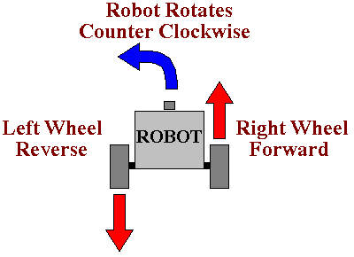

Turning
---

Being able to make turns is an important part of driving a particular path.
In this section we will be exploring how to make turns.

## Turning Pivot

If you remember, doing a Left turn required us to either:

- Only move the right wheel, or 

- Make the right wheel go fwd, and the left wheel go back

*Try both!*

## It's Your Turn!

Load [THIS LINK](https://gears.aposteriori.com.sg/index.html?worldJSON=https%3A%2F%2Ffiles.aposteriori.com.sg%2Fget%2FM9YRPKGWt7.json&robotJSON=https%3A%2F%2Ffiles.aposteriori.com.sg%2Fget%2F7r9K65arhz.json&filterBlocksJSON=https%3A%2F%2Ffiles.aposteriori.com.sg%2Fget%2Fo22H2evjjT.json)

Use the same Move Tank block to try and make a perfect *left turn*.  

You'll need to decide on which wheel to move fwd/back or keep off, and you will need to do some trial and error on the number of rotations.

<video autoplay muted loop width=450 height="auto">
  <source src="images/codeLeftTurn.mp4" type="video/mp4">
</video>

**Challenges:**

- Turn Left 4 times, until your'e back to the same position

- Turn Left, then turn right back to the same position

## Test 

- Load [this version of GearsBot](https://quirkycort.github.io/gears/public/index.html?worldJSON=https%3A%2F%2Ffiles.aposteriori.com.sg%2Fget%2FMLrEZXWzdo.json&robotJSON=https%3A%2F%2Ffiles.aposteriori.com.sg%2Fget%2F7r9K65arhz.json&filterBlocksJSON=https%3A%2F%2Ffiles.aposteriori.com.sg%2Fget%2Fo22H2evjjT.json&worldScripts=world_challenges)

- Click on *Simulator Tab* to see Challenge

- Follow instructions and note down the *special Code* after doing the challenge successfully!

