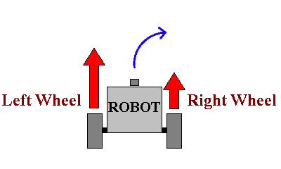
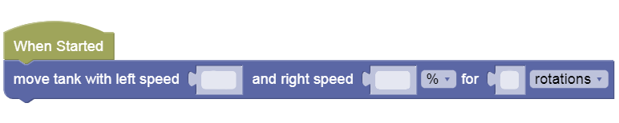

Soft Turns
---

Sometimes your robot will want to move less like a square, and more like a racing car!

For that, we need to learn how to make some soft turns, or move in arcs and circles.

## Arcs & Circles

You will need to play around with wheel speeds to get the turning right.

Then to make an arc, you just have to move some distance in that direction without completing a full circle...

Or you can try to figure out just how many rotations/desgrees it takes to complete one full circle, or more!

## Circle Challenge

- Open **[this challenge](https://quirkycort.github.io/gears/public/index.html?worldJSON=https%3A%2F%2Ffiles.aposteriori.com.sg%2Fget%2FuEks4FnMpu.json&filterBlocksJSON=https%3A%2F%2Ffiles.aposteriori.com.sg%2Fget%2Fo22H2evjjT.json&worldScripts=world_challenges)**

- Try to play with the various speeds and distances to complete a perfect circle without bumping the tree or falling off!

