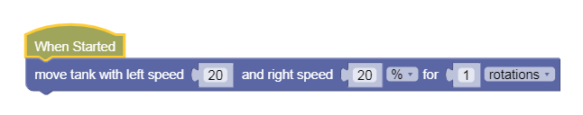
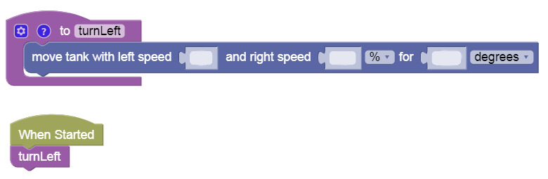

Simple Maze Challenge
---

## Maze World

You are ready for the Maze Test!

**Test 1: Get to the Red Square!**

- Load [this challenge](https://gears.aposteriori.com.sg/index.html?worldJSON=https%3A%2F%2Ffiles.aposteriori.com.sg%2Fget%2FuocXxvB4c4.json&filterBlocksJSON=https%3A%2F%2Ffiles.aposteriori.com.sg%2Fget%2Fe4NgMru2ij.json&worldScripts=world_challenges)

- Click on *Simulator Tab* to see Challenge

- Follow instructions and note down the *special Code* after doing the challenge successfully!

## Abstracting With Simple Functions

You'll have to start by making the robot go 1 grid distance forward.  

Then Turn Right.

Then go 1 grid distance forward again... and so on!

You can write out your program in words first like I just started.  And then translate that to code blocks.

**Only use the Move Tank block under Motion as before.**

Hint:  Once you figure out the perfect # of rotations or degrees or seconds to move 1 grid distance, you can reuse that block over and over by copying it, or by turning it into a function, like this:

This really allows you to **Abstract** away details!

You can add functions for:

- Turn Left
- Turn Right
- Move Fwd 1 Maze Square
  - Or more challeging: Move Fwd [CHOOSE] Maze Squares

Then your maze code will be more readable: move fwd, turn right, move fwd, turn left, move fwd, turn right, move fwd...

## Debugging

Remember to test your program all the time.  Don't try adding 10 blocks and test it all once at the end.  Test after each code change, unless you're extremely sure about your code.

If something doesn't work as expected, figure out which block is probably causing it.  Then look over that code carefully.  Make small changes that you think would tell you if what you're looking at is probably the faulty area.

Test and repeat... Eventually your robot will glide all the way to the finish area - blue grid.

**Test 2: Get to the Pink Square!**

You can reuse the 3X3 Red code you created.  You need to get a little further!

- Load [this challenge](https://gears.aposteriori.com.sg/index.html?worldJSON=https%3A%2F%2Ffiles.aposteriori.com.sg%2Fget%2FkKLy7LPrdt.json&filterBlocksJSON=https%3A%2F%2Ffiles.aposteriori.com.sg%2Fget%2Fe4NgMru2ij.json&worldScripts=world_challenges)

- Click on *Simulator Tab* to see Challenge

- Follow instructions and note down the *special Code* after doing the challenge successfully!

**Test 3: A Bigger Maze!**

- Load [this challenge](https://gears.aposteriori.com.sg/index.html?worldJSON=https%3A%2F%2Ffiles.aposteriori.com.sg%2Fget%2F5AP3fmip7c.json&filterBlocksJSON=https%3A%2F%2Ffiles.aposteriori.com.sg%2Fget%2Fe4NgMru2ij.json&worldScripts=world_challenges)

- Click on *Simulator Tab* to see Challenge

- Follow instructions and note down the *special Code* after doing the challenge successfully!
