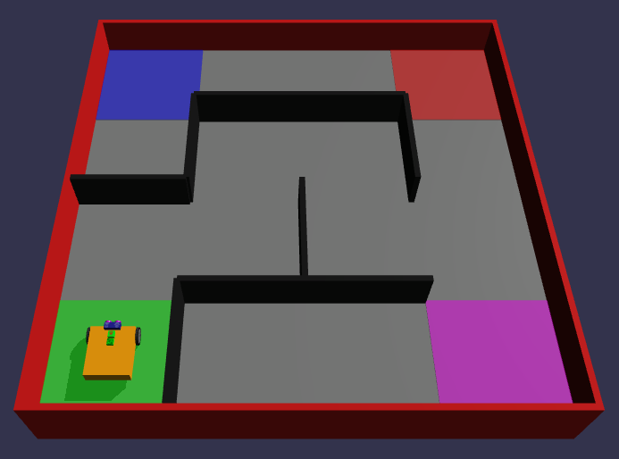

Simple Maze Challenge
---

## Maze World

Let's create a Challenge World using the Maze concept.

First go to the **Simulation** tab, and click the World Map icon.

Then choose **Maze Map**.

Below that, change:

- The Number of columns to 3
- The Number of rows to 3
- The Maze Seed to 0

<video autoplay muted loop width=100% height="auto">
  <source src="images/mazeSetup.mp4" type="video/mp4">
</video>

## Coding

You'll have to start by making the robot go 1 grid distance forward.  

Then Turn Right.

Then go 1 grid distance forward again... and so on!

You can write out your program in words first like I just started.  And then translate that to code blocks.

Only use the 2nd Move Tank block under Motion as before.

Hint:  Once you figure out the perfect # of rotations or degrees or seconds to move 1 grid distance, you can reuse that block over and over by copying it, or by turning it into a function... 

More on that when you finish your first Maze Challenge!

## Debugging

Remember to test your program all the time.  Don't try adding 10 blocks and test it all once at the end.  Test after each code change, unless you're extremely sure about your code.

If something doesn't work as expected, figure out which block is probably causing it.  Then look over that code carefully.  Make small changes that you think would tell you if what you're looking at is probably the faulty area.

Test and repeat... Eventually your robot will glide all the way to the finish area - blue grid.

## Challenges

- Try setting the Maze Seed to 2 and make it all the way to the Pink square.

- Try setting the rows and columns to 4, to get a bigger maze.  Can you make it to the end?

## Observations

Discuss with your teacher, mentor or other students what are some of the things you noticed about the Maze World and your robot's behavior.