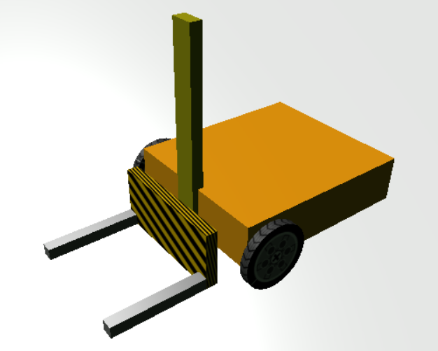
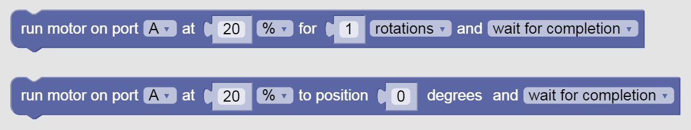
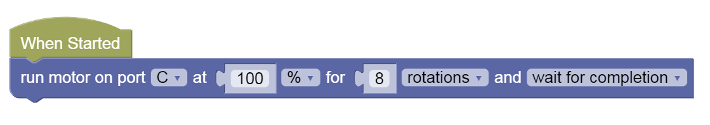

Linear Actuator
---

We already learned about one actuator - the pen.

Actuator means an electronic device that can act on its environment, usually in the form of:

- Light
- Sound
- Movement

Robots use actuators like motorized wheels to move, motorized arms, LEDs or lights and speakers to interact with their environment.

Our robot already has wheels.

Let's add a Linear Actuator!

## What is a Linear Actuator?

<video autoplay muted loop width=450 height="auto">
  <source src="https://thumbs.gfycat.com/DecisiveEssentialCarpenterant-mobile.mp4" type="video/mp4">
</video>

A Linear actuator is a motorized device that moves in a linear fashion - in a line.  Back and forth.  As opposed to most, which move in a circle or a rotational manner.

This kind of device can be very useful for: 

- Elevators
- Forklifts
- Printers

## Try Our Forklift Robot!

Enter [this Gearsbot world](https://quirkycort.github.io/gears/public/index.html?worldJSON=https%3A%2F%2Ffiles.aposteriori.com.sg%2Fget%2F5iFfZcUZLm.json&robotJSON=https%3A%2F%2Ffiles.aposteriori.com.sg%2Fget%2FoMA6FRE6Nv.json&filterBlocksJSON=https%3A%2F%2Ffiles.aposteriori.com.sg%2Fget%2FU3gobq2VTv.json) to test out a Forklift Robot.

You can use the Joystick to drive it around like usual.  But notice that we now also have a forklift linear actuator on the front of the robot.  If we want to move it, we need to use the motor it's attached to - motorC (A & B are being used for the two wheels).

Notice we now have two new Motor Blocks.  

These blocks can control single motors indepdently.  Note that linear actuators that use DC or Stepper motors like the ones we have in GearsBot require more rotations to move a small distance compared to wheels.

For instance let's try this code:

Run the code - what does it do?

## Challenges

- Make the Forklift go up (say, 10 rotations) and back down to the starting point

- Lift the crate

- Move the crate to another side of the space

- Put the crate down on the floor and move away

## Test 1

- Load [this challenge](https://quirkycort.github.io/gears/public/index.html?worldJSON=https%3A%2F%2Ffiles.aposteriori.com.sg%2Fget%2FfBTX86iAbK.json&filterBlocksJSON=https%3A%2F%2Ffiles.aposteriori.com.sg%2Fget%2FU3gobq2VTv.json&worldScripts=world_challenges)

- Click on *Simulator Tab* to see Challenge

- Follow instructions and note down the *special Code* after doing the challenge successfully!

## Test 2

- Load [this challenge](https://quirkycort.github.io/gears/public/index.html?worldJSON=https%3A%2F%2Ffiles.aposteriori.com.sg%2Fget%2FXbEgDo8ooG.json&robotJSON=https%3A%2F%2Ffiles.aposteriori.com.sg%2Fget%2FoMA6FRE6Nv.json&filterBlocksJSON=https%3A%2F%2Ffiles.aposteriori.com.sg%2Fget%2FU3gobq2VTv.json&worldScripts=world_challenges)

- Click on *Simulator Tab* to see Challenge

- Follow instructions and note down the *special Code* after doing the challenge successfully!

## Test 3 

- Load [this challenge](https://quirkycort.github.io/gears/public/index.html?worldJSON=https%3A%2F%2Ffiles.aposteriori.com.sg%2Fget%2Fk6P2Bj7663.json&robotJSON=https%3A%2F%2Ffiles.aposteriori.com.sg%2Fget%2FoMA6FRE6Nv.json&filterBlocksJSON=https%3A%2F%2Ffiles.aposteriori.com.sg%2Fget%2FU3gobq2VTv.json&worldScripts=world_challenges)

- Click on *Simulator Tab* to see Challenge

- Follow instructions and note down the *special Code* after doing the challenge successfully!