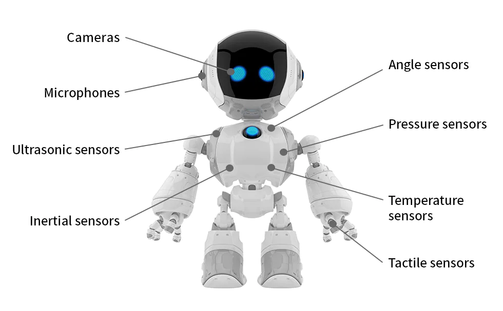
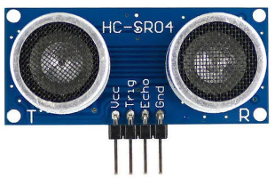
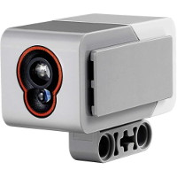
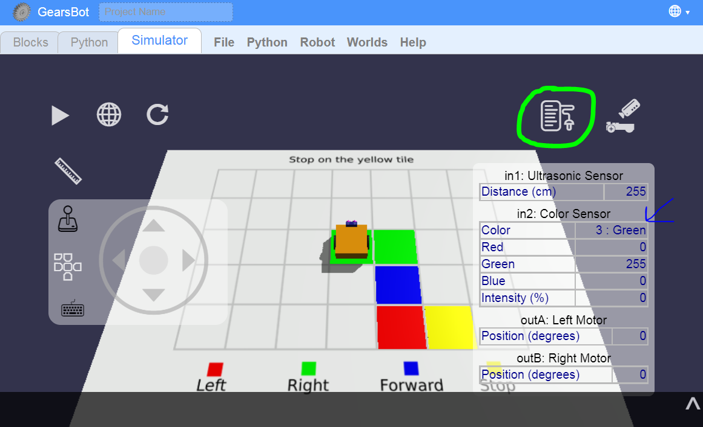

Sensing
---

So far we have programmed robots to do some pretty simple tasks that are repetitive and easy for the robot to do well over and over again.

Traditionally, that's all robots did in manufacturing & automation applications.

<iframe width="560" height="315" src="https://www.youtube.com/embed/anDBlJM2Rac?start=35" title="YouTube video player" frameborder="0" allow="accelerometer; autoplay; clipboard-write; encrypted-media; gyroscope; picture-in-picture" allowfullscreen></iframe>

But, nowadays robots do all kinds of work that requires them to see, touch or even hear the environment around them to function properly.

<iframe width="560" height="315" src="https://www.youtube.com/embed/gNYT4pVvweA" title="YouTube video player" frameborder="0" allow="accelerometer; autoplay; clipboard-write; encrypted-media; gyroscope; picture-in-picture" allowfullscreen></iframe>

## Sensors

Sensors are a way for robots to experience aspects of its environment.

Sensors are to robots what our eyes, ears, and finger nerve endings are for us humans.

They don't work exactly the same, though, so in order to control robots to do some specialized task, we have to learn how sensors work and how we can use them in our programs.

## GearsBot Sensors

GearsBot supports several types of sensors, and these two are realted to vision:

### Ultrasonic Sensor

Ultra means very high.
Sonic means sound.

Even though this sensor utilizes sound waves, it actually is closer to an eye than a ear.

It can help robots see like a bat, using echo-location to find solids in front of it.

### Color Sensor

This sensor is a bit like one pixel in our eye.  Our eyes have many such color sensors (rods & cones), but way smaller, and together they can see a full picture, but the Color Sensor can just see a small area.  It is not able to detect features or visualize a whole scene like a camera.

We can use it to find things, or make movement decisions, like follow lines.

Here is an example of a SumoBot using both Ultrasonic & Color Sensor:

<video autoplay muted loop width=100% height="auto">
  <source src="images/sumo.mp4" type="video/mp4">
</video>

### Port View

You can see what the sensors "see" by looking at the Port View:

Use [this world](https://quirkycort.github.io/gears/public/index.html?worldJSON=https%3A%2F%2Ffiles.aposteriori.com.sg%2Fget%2FXgrApkT72B.json&filterBlocksJSON=https%3A%2F%2Ffiles.aposteriori.com.sg%2Fget%2FNNCXg4pVKe.json&worldScripts=world_challenges) with Port View to see the various colors seen by the robot as you drive over them with Joystick control.