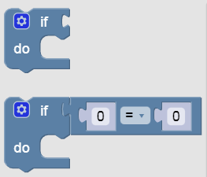

Color Sensor - Conditionals
---

For most robots, the world is just as confusing as it is for us.

Therefore we usually have to program a lot of rules for them to follow to make it easy.

Whenever a robot needs to make a decision it requires a coding block called a conditional, or IF/ELSE.

Look under the Logic block category and find these:

Note that when you press on the gear icon you can add **Else If** abd **Else** sub-blocks.

In our next test, we will need to use IF/ELSE blocks to make decisions about what to do.  Let's do it together!

## Color Sensor - Test 3

- Load [this challenge](https://quirkycort.github.io/gears/public/index.html?worldJSON=https%3A%2F%2Ffiles.aposteriori.com.sg%2Fget%2FBxeH8YhYtW.json&filterBlocksJSON=https%3A%2F%2Ffiles.aposteriori.com.sg%2Fget%2FNNCXg4pVKe.json&worldScripts=world_challenges)

- Click on *Simulator Tab* to see Challenge

- Our ALGORITHM or set of instructions to the robot is:

  - **IF *SEE RED***

    - Turn Left

  - **ELSE (must be Green)**

    - Turn Right

  - After that, just drive Forward a bit

<video autoplay muted loop width=100% height="auto">
  <source src="images/algorithmTwoChoices.mp4" type="video/mp4">
</video>

- Follow the algorithm as shown in the video above and make sure to add the correct movement blocks to turn left, right, and go forward.

- Follow instructions to complete the challenge and take a screenshot with your *Completion Code*.

## Color Sensor - Test 4

- Load [this challenge](https://quirkycort.github.io/gears/public/index.html?worldJSON=https%3A%2F%2Ffiles.aposteriori.com.sg%2Fget%2FTLMcGByAiq.json&filterBlocksJSON=https%3A%2F%2Ffiles.aposteriori.com.sg%2Fget%2FNNCXg4pVKe.json&worldScripts=world_challenges)

- Click on *Simulator Tab* to see Challenge

- Hint: You will need to use one of our Loop blocks to **repeat the simple IF/ELSE ALGORITHM twice**... 

- Follow instructions to complete the challenge and take a screenshot with your *Completion Code*.

## Color Sensor - Test 5

- Load [this challenge](https://quirkycort.github.io/gears/public/index.html?worldJSON=https%3A%2F%2Ffiles.aposteriori.com.sg%2Fget%2FkCqxaeUggV.json&filterBlocksJSON=https%3A%2F%2Ffiles.aposteriori.com.sg%2Fget%2FNNCXg4pVKe.json&worldScripts=world_challenges)

- Click on *Simulator Tab* to see Challenge

- What is the ALGORITHM or set of instructions now?  It's quite similar to the last test...

  - Will need to **add an ELSE IF in between**, since we have more than 2 choices...

- Follow instructions to complete the challenge and take a screenshot with your *Completion Code*.