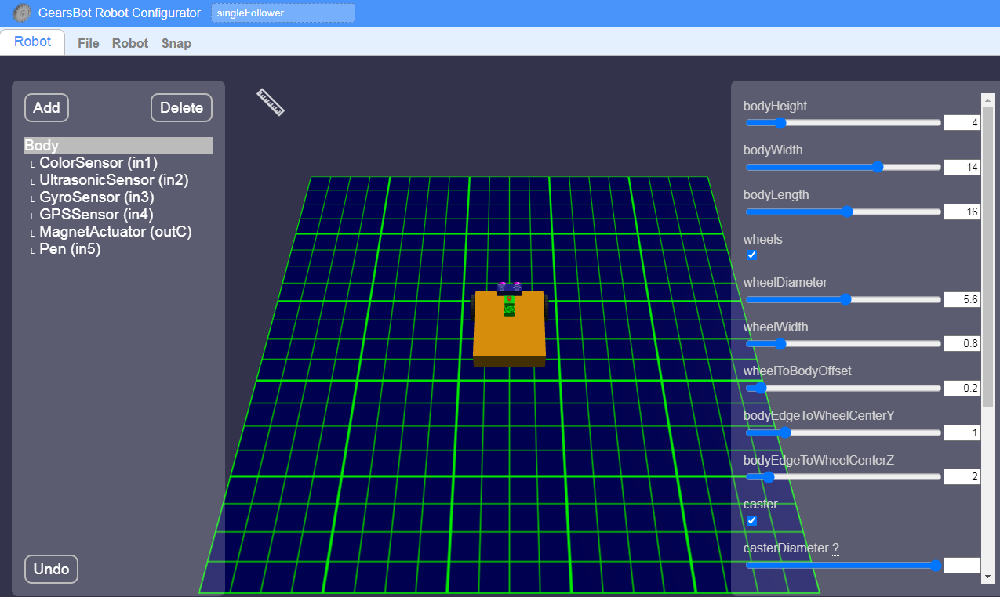
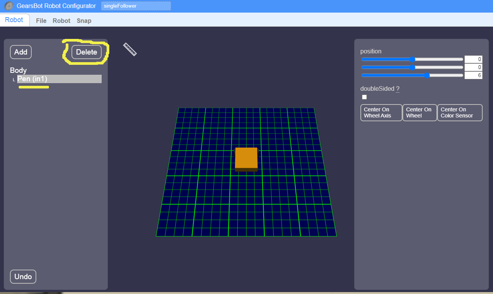
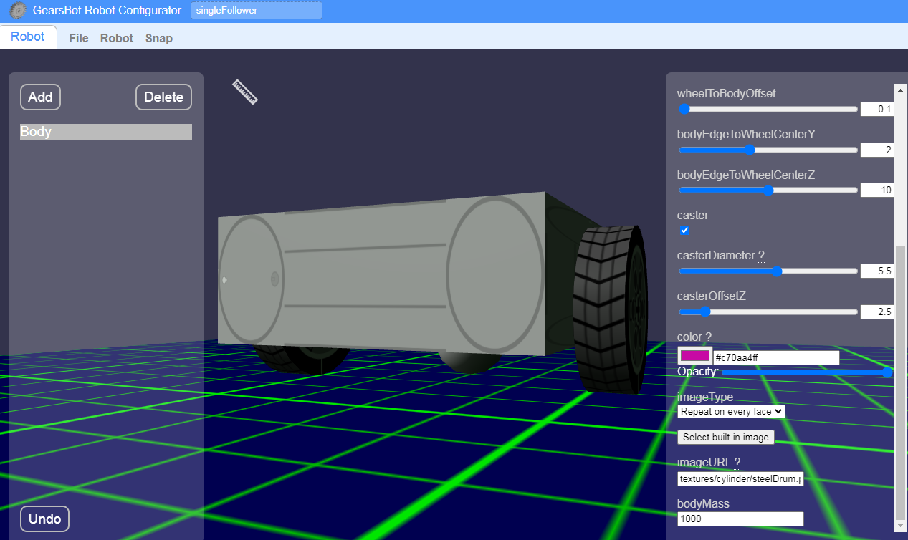

Robot Configurator
---

We can do a lot more with the Worlds and Robots we already have in GearsBot.

But, now we want to try to make cool-looking robots for a Robotic Dance Show!

We can modify the basic GearsBot in the [Robot Configurator](https://gears.aposteriori.com.sg/configurator.html).

Some Basics:

- The left pane contains all the different mechanical parts of your Robot:

  - Simple shapes
  - Sensors
  - Actuators

- The right pane is for properties for whichever robot part is selected

  - Height
  - Width
  - Depth
  - Relative Position
  - Rotation
  - Color/Skin
  - More...

- You can use the mouse to rotate, zoom, pan the configured robot in the middle.  You will need to get good at that to:

  - Place things relative to other things
  - View your robot from different angles

Let's Go Real Simple
---

First let's strip our basic robot of all its sensors and magnet actuator...

Under **Body** in the left pane, take turns clicking on all the extra parts associated with the robot, and delete them!

You should be left with just a Body!

Feel free to customize the base of your robot:

- Height, Weidth, Length
- Size of wheels
- Size and offset of Caster (ball in back)
- Color or Skin

For instance:

