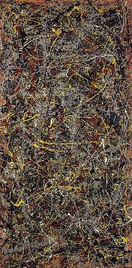
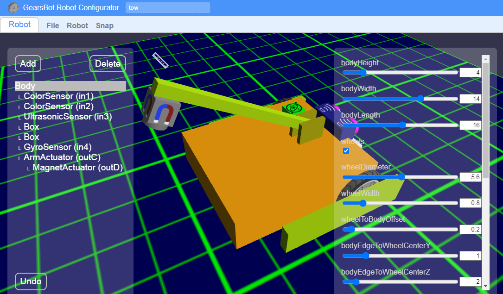

Course Overview
---

To load this course you can navigate to:

<h1>http://a9i.sg/gt</h1>

This is a continuation of our Beginner's course [**Computational Thinking with GearsBot**](http://a9i.sg/p1).

As we saw in our basic course, <u>Computational Thinking</u> is a way to consider problems and a set of skills to use when performing any analytical or technical work, like:

- __ Solving a math problem
- __ Finding a buried treasure
- __ Dealing with an annoying sibling

Basically, when you use your brain for almost anything that's not automatic like breathing, or maybe overly creative and emotive like painting Jackson Pollock abstract art - maybe...

In this follow-up course, we will continue to explore the concepts of Computational Thinking - Decomposition, Abstraction, Pattern Recognition, and Algorithmic Thinking while we deal with higher levels of complexity in the realm of Virtual Robotics and solve much harder problems.

 
 
 

So, get ready to **build, connect, and code** as we continue our journey into the world of 

<h1>Robotics!</h1>
