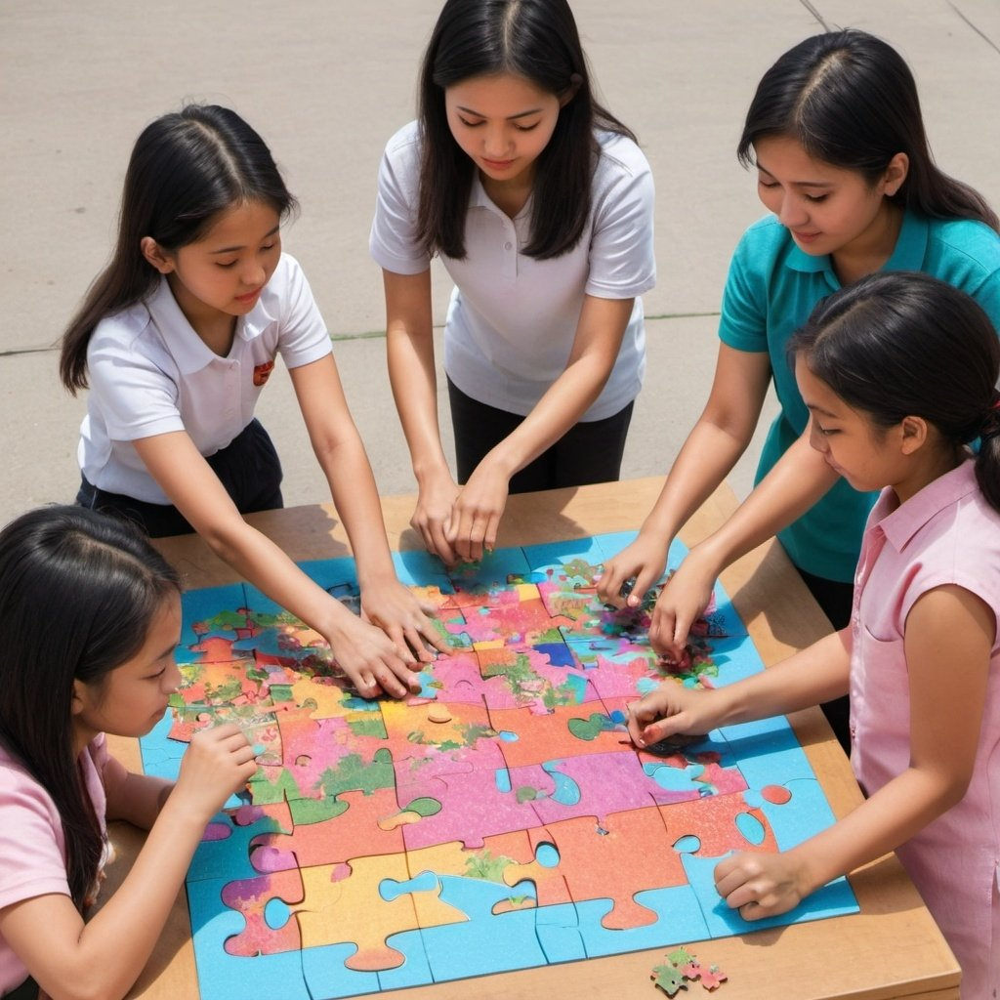
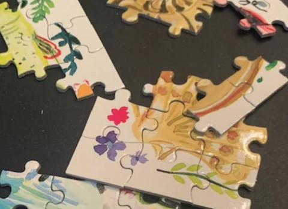
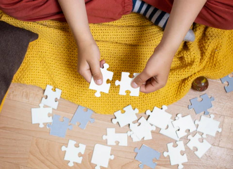
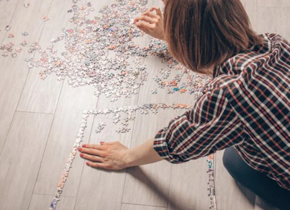
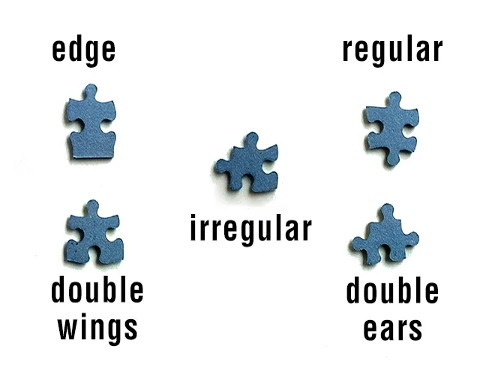
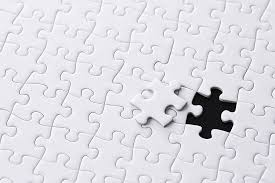

Computational Thinking
---

 

Computational thinking is really about using your brain to solve big problems by:

- <h2>breaking them down into smaller, easier ones</h2>
- <h2>planning solutions out, and following the plans</h2>
- <h2>testing ideas in an efficient way</h2>
- <h2>finding and fixing issues</h2>
- <h2>and learning from what you did...</h2>

*Tip: Computational Thinking skills kids can learn also help programmers write code and engineers design cool things like your iPads!*

----

<h2>4 Computational Thinking skills</h2>

**1. Decomposition: Breaking down problems into smaller pieces**

*Concentrate on small sections of the puzzle one by one and piece them together*

**2. Pattern Recognition: Noticing when things are alike or very different** 
   

*Group pieces by colors or shades as probably from the same puzzle section*

**3. Algorithmic Thinking: Creating and following logical plans** 

*First find border pieces, then complete border, then do section...*
    
**4. Abstraction: Ignore some details and concentrate on others**

*Group pieces by shape to solve large sections of very similar color pieces, like a sky*

Let's learn how to use these concepts in a real-world puzzle!

<h2>SOLVED :)</h2>