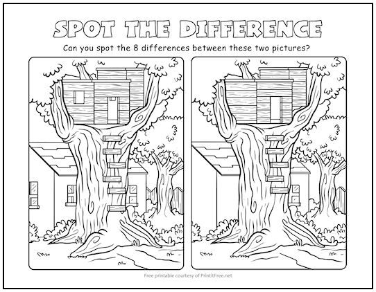

Spot the DIfference
---
Let's solve a common, fun puzzle using some Computational Thinking skills!

**1. Decomposition: Breaking down problems into smaller pieces**

 - We don't have to find all 8 things all at once! Look for each difference one at a time!  So For each difference we will cross it out!

**2. Pattern Recognition: Noticing when things are alike or very different** 

 - We immediately see a tree, a tree house, a ladder, a house behind... So our brain is quite good at this already.  We just have to find the difference in these patterns in this example.

**3. Algorithmic Thinking: Creating and following logical plans** 

 - Plan: I start by just seeing things pop out at me!  But, when I start to get desperate for the last few differences I didn't just notice, I start scanning the image, from the bottom then a bit higher, then higher, then higher - as I scan upwards, for each bush, branch, ladder step, window I look at the other picture...

**4. Abstraction: Ignore some details and concentrate on others**

 - Ignore unnecessary details: don't have to look at every leaf squiggle to see the ladder or window.  We can also ignore bits of the image we already found a difference in.

 
 

 
