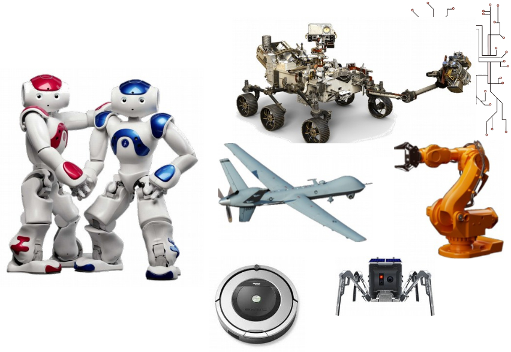
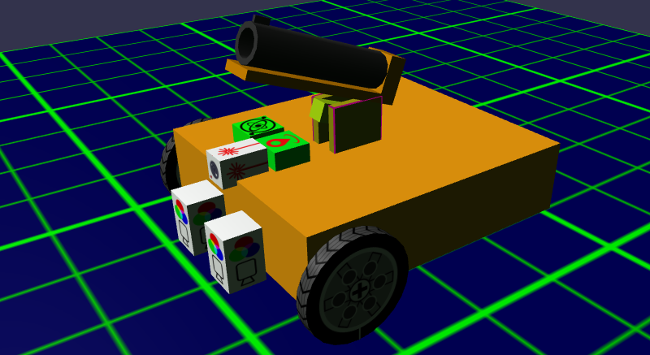

What is a Robot?
---

Take a moment to reflect on the various machines in the illustration above.

Which one would you consider a robot?  Some?  None?  All?

Today, almost anything automated is called a robot, from factory robot arms to driverless cars, from chatbots to other types of software that automate some business or organizational process (bot).

We are going to focus mainly on the class of physical robots that most resemble driverless cars...

As such, our robots will all share some basic electronic & mechanical elements:

- **Computer Brain** (what we code)
- **Body / Frame**
- **Motors** (mainly wheels, but also lifting, pushing, and painting other objects in the environment)
- **Sensors** (robot needs to seee the environment)
- **Wiring** (won't see this - engineers usually hide them)

