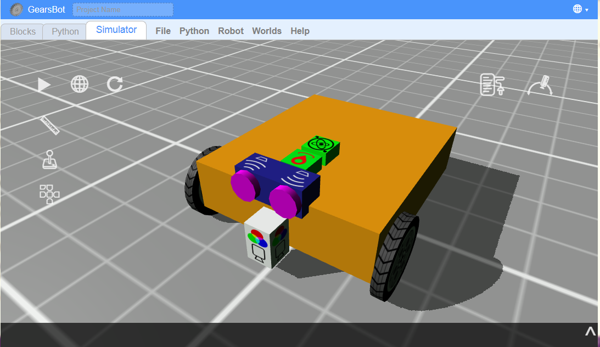
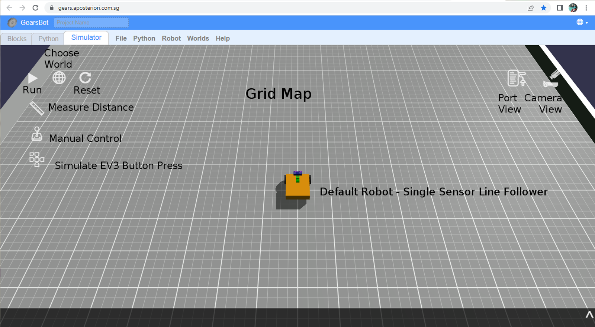
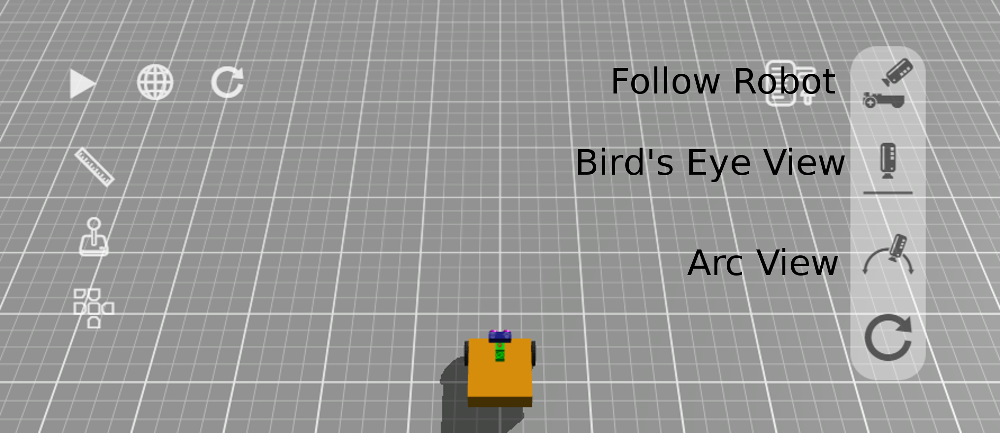
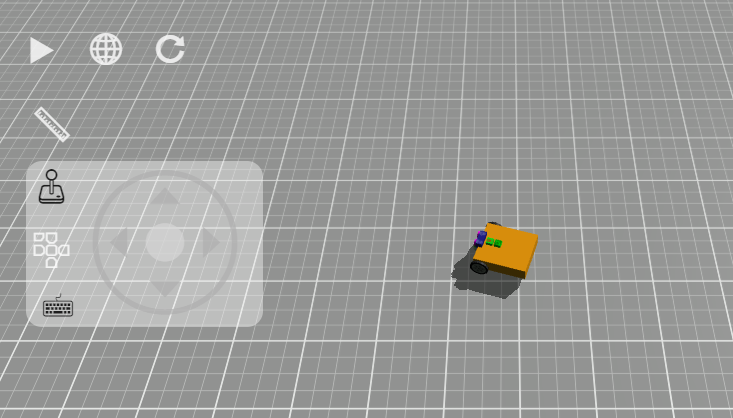

The GearsBot App - Review
---
### ***Starting Out***

Click [here](https://gears.aposteriori.com.sg/index.html?filterBlocksJSON=https%3A%2F%2Ffiles.aposteriori.com.sg%2Fget%2FsbVQLkhtDr.json) to open Gears platform!

If you've done our Beginner module you are already familiar with the GerarsBot platform!

But in this version of GearsBot, you have a lot more freedom and choices, but also a lot more complexity!

*Tip: You will no longer get Forward, Back, Left, Right - you will have to tell the motors how to do that!*

<u>UI Review</u>

- **Blocks** tab is where you code using block-based programming.
- **Simulator** tab is where the robot runs are simulated in a virtual, but physics-based world.

- **Python** tab is where you code using Python - you can ignore this unless you love Python

### ***Camera***

The Camera control is very useful.  You can look at the world and the robot from many different angles, you can find issues with new world you create.  You can zoom in or pan to a particular part of the world or the robot.

In short get comfortable with the various camera options and view controls.

- **Follow Robot**: camera keeps moving with robot.  You can use the left mouse button to change the camera position around the center view of the robot itself.

- **Bird's Eye View**: camera is placed orthogonally above the robot and mat.  Use the left mouse button to pan.

- **Arc View**: Anchor the camera wherever you want to keep a specific viewpoint as the robot moves around the world.  Use the left mouse button to change the rotation of the viewpoint, and the right button to pan.

- **Reset Camera** just changes back to default (Follow Robot) view.

Mouse wheel can be used to zoom in and out in all three views.

### ***Manual Control***

Use manual control to make the robot drive around.
It's not quite like driving a car.
For one we have a differential drive system, with **each wheel moving independently**.  

Click on the Joystick and use the mouse/touch or arrow keys to move the robot around.

### **Port View**

Open the Port View and drive and look at changing values.  

Specifically, you should concentrate on the **ultrasonic sensor** that "sees" the walls around, and the wheels run by **left & right motors**.

Reset the world/simulation, to reset the motor positions.

Something you can check - how far does 360 degrees of wheel rotations get your robot?

<video autoplay muted loop width=100% height="auto">
  <source src="images/portview.mp4" type="video/mp4">
</video>

Now let's begin coding the robot movement...