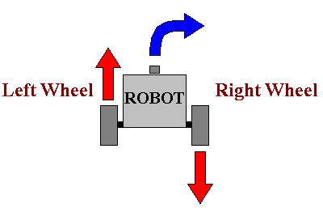

2-Wheel Robots & Move Tank
---

GearsBot and most robotic platforms don't work like cars:

In cars one engine is usually powering 2 or 4 wheels.  The steering is handled via rotating the wheels along a second dimension.  

The most common robotic platforms in use today for industrial, commmercial and educational purposes are **2-Wheel Differentiated-Drive** robots.

**Differentiated Drive** means that each wheel is controlled by a different, independent motor. 

Here is an example of 2-wheel wharehouse robots:

<iframe width="640" height="360" src="https://www.youtube.com/embed/FBl4Y55V2Z4" title="YouTube video player" frameborder="0" allow="accelerometer; autoplay; clipboard-write; encrypted-media; gyroscope; picture-in-picture" allowfullscreen></iframe>

The Roomba, and various robots deployed to Hawker centers and food courts are all built on similar principles.

The steering is handled by controlling each wheel separately.

Depending on wheel placement, you will also need one or more caster wheels or ball bearings to just balance the rest of the frame, like this:

# **MOVEMENT BLOCKS**

Let's figure out how to make our robot move in the four directions we are used.  You can start by loading Gears [here](https://gears.aposteriori.com.sg/index.html?filterBlocksJSON=https%3A%2F%2Ffiles.aposteriori.com.sg%2Fget%2FsbVQLkhtDr.json).

## Forward

To move forward, you need to rotate both tires forward at the same speed:

*Tip: We use %20, a relatively low speed, to avoid a jittery movement.  You can try max speeds %100 to see the difference.*

---

## Back

To move forward, you need to rotate both tires back at the same speed:

**Challenges:**

- Change the speeds to go slower or faster, but remember to keep them the same speeds on both sides to go forward

- Make your robot go backward.  What numbers do you think would make your robot reverse?  (yes, negatives!)

---

## Right

To turn in either direction you will need to vary the direction and/or speeds of the two motors.

For instance to turn right, you can rotate the left tire forward and the right tire backward at the same speed:

---
## Left

Similarly, to turn left, you reverse and rotate left tire back, and right tire forward.
  

