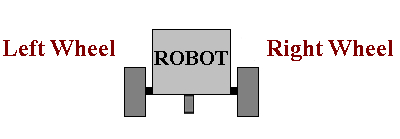

2-Wheel Robots & Move Tank
---

GearsBot and most robotic platforms don't work like cars:

In cars one engine is usually powering 2 or 4 wheels.  The steering is handled via rotating the wheels along a second dimension.  

The most common robotic platforms in use today for industrial, commmercial and educational purposes are **2-Wheel Differentiated-Drive** robots.

**Differentiated Drive** means that each wheel is controlled by a different, independent motor. 

Here is an example of 2-wheel wharehouse robots:

<iframe width="640" height="360" src="https://www.youtube.com/embed/FBl4Y55V2Z4" title="YouTube video player" frameborder="0" allow="accelerometer; autoplay; clipboard-write; encrypted-media; gyroscope; picture-in-picture" allowfullscreen></iframe>

The Roomba, and various robots deployed to Hawker centers and food courts are all built on similar principles.

The steering is handled by controlling each wheel separately.

Depending on wheel placement, you will also need one or more caster wheels or ball bearings to just balance the rest of the frame, like this:

# **MOVEMENT BLOCKS**

Let's figure out how to make our robot move in the four directions we are used.  

Start by loading Gears [here](https://gears.aposteriori.com.sg/index.html?filterBlocksJSON=https%3A%2F%2Ffiles.aposteriori.com.sg%2Fget%2FsbVQLkhtDr.json).

## Forward

To move forward, you need to rotate both tires forward at the same speed:

---
 

## Speed Numbers -100 to 100

 

Depending on your level, you may not have covered numbers to 100, or negative numbers, so this is a brief review of the numbers from -100 to 100.

- 100: full speed forward
- 50: half speed forward
- 0: stop
- -50: half speed backwards
- -100: full speed backwards

*Tip: We use %20, a relatively low speed, to avoid a jittery movement.  You can try max speeds %100 to see the difference.*

## Practice 1

- **Change the speeds** to go slower or faster, but remember to keep them the same speeds on both sides to go forward

- Use [this Gears world](https://gears.aposteriori.com.sg/index.html?filterBlocksJSON=https%3A%2F%2Ffiles.aposteriori.com.sg%2Fget%2FsbVQLkhtDr.json)

---

 

## Rotations, Degrees, Seconds, Milliseconds

The last parameter/input in this code block refers to how far or how long you want your robot to go.  You can experiment with different options:

For now just use **Rotations**

## Practice 2

- **Change the amount your wheels rotate** to make your robot bump into the wall!

- Use [this Gears world](https://gears.aposteriori.com.sg/index.html?filterBlocksJSON=https%3A%2F%2Ffiles.aposteriori.com.sg%2Fget%2FsbVQLkhtDr.json)

---

 

## Back

To move back, you need to rotate both tires back at the same speed:

## Practice 3

- Make your robot **go backward** until it hits the back wall

- Use [this Gears world](https://gears.aposteriori.com.sg/index.html?filterBlocksJSON=https%3A%2F%2Ffiles.aposteriori.com.sg%2Fget%2FsbVQLkhtDr.json)

 

