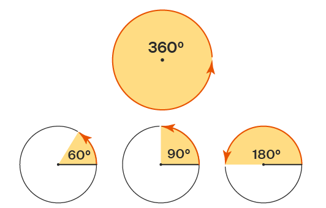

Movement Sequences
---

Let's test our Tank Movement blocks in Sequential programs.

## Statements

The fundamental unit of a code is an execution **statement**.  

Do this.  

Do that.  

One or more statements following each other is called a **sequence**, meaning one statement follows another.

## Challenge 1

Let's try some simple code sequences. 

- Load [this challenge](https://gears.aposteriori.com.sg/index.html?worldJSON=https%3A%2F%2Ffiles.aposteriori.com.sg%2Fget%2FM5HDzaVWhm.json&robotJSON=https%3A%2F%2Ffiles.aposteriori.com.sg%2Fget%2F7r9K65arhz.json&filterBlocksJSON=https%3A%2F%2Ffiles.aposteriori.com.sg%2Fget%2FsbVQLkhtDr.json&worldScripts=world_challenges)

- Click on *Simulator Tab* to see Challenge

HEY! No Joystick...

**Algorithmic Thinking** - in the above challenge, we could make the robot *move forward 3 times*:

- Move Forward 1 Rotation
- Move Forward 1 Rotation
- Move Forward 1 Rotation

- Follow instructions and *take a screenshot* of the special **Completion Code**!

## Move Tank

Instead of 3 Move Forwards, can you do the above with just 1 Move Tank block?

How far is Move Tank moving forward?  **1 Rotation**

However far 1 rotation of the wheels gets you - which is the circumference of the wheel.  

*Tip: The bigger the wheel the further you'd go using 1 rotation...*

Some other math concepts you may not have covered yet:

Also, **1 Rotation = 360 degrees** 

If you want to go less than 1 rotation, change the distance unit to degrees.  

For instance, to go half as far, use 180 degrees.

If you know your fractions and decimals, 180 degree is 0.5, or half of a full rotation.

## Practice 1

Can you make the robot go until **JUST before the wall?**

- Use [this Gears world](https://gears.aposteriori.com.sg/index.html?filterBlocksJSON=https%3A%2F%2Ffiles.aposteriori.com.sg%2Fget%2FsbVQLkhtDr.json)

## Challenge 2

Solve the same challenge by using **1 Move block only**, by changing the Rotations/Degrees

- Load [this challenge](https://gears.aposteriori.com.sg/index.html?worldJSON=https%3A%2F%2Ffiles.aposteriori.com.sg%2Fget%2FM5HDzaVWhm.json&robotJSON=https%3A%2F%2Ffiles.aposteriori.com.sg%2Fget%2F7r9K65arhz.json&filterBlocksJSON=https%3A%2F%2Ffiles.aposteriori.com.sg%2Fget%2FsbVQLkhtDr.json&worldScripts=world_challenges)

## Practice 2

Write a sequence that make the robot **go back and forth 4 times**

- Use the [basic world](https://gears.aposteriori.com.sg/index.html?filterBlocksJSON=https%3A%2F%2Ffiles.aposteriori.com.sg%2Fget%2FsbVQLkhtDr.json) 

What should we call this dance move?

<video autoplay muted loop width=450 height="auto">
  <source src="images/backandforth.mp4" type="video/mp4">
</video>

## Practice 3

Create a sequence that makes the robot each time **go 2 steps forward, 1 step back**... repeat that three times!

- Use the [basic world](https://gears.aposteriori.com.sg/index.html?filterBlocksJSON=https%3A%2F%2Ffiles.aposteriori.com.sg%2Fget%2FsbVQLkhtDr.json) 

## Practice 4

Create another sequence like above, but each time make the robot go further forward and backward - like this pattern

  - 1 forward, 1 back
  - 2 forward, 2 back
  - 3 forward, 3 back... 

Use the [basic world](https://gears.aposteriori.com.sg/index.html?filterBlocksJSON=https%3A%2F%2Ffiles.aposteriori.com.sg%2Fget%2FsbVQLkhtDr.json) 
