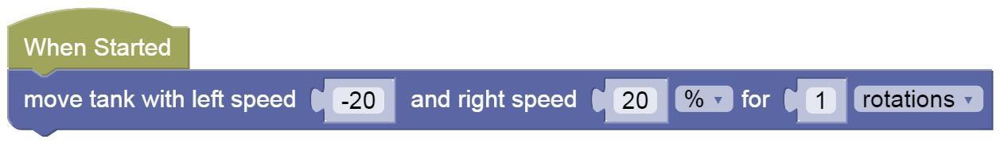
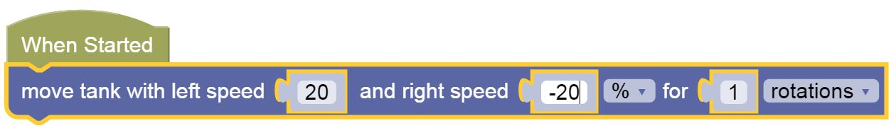

Sharp Turns
---

Being able to make turns is an important part of driving a particular path.

In this section we will be exploring how to make turns.

---

## Left

To turn left, you reverse and rotate left tire back, and right tire forward.
  

## It's Your Turn!

Load [THIS LINK](https://gears.aposteriori.com.sg/index.html?worldJSON=https%3A%2F%2Ffiles.aposteriori.com.sg%2Fget%2FM9YRPKGWt7.json&robotJSON=https%3A%2F%2Ffiles.aposteriori.com.sg%2Fget%2F7r9K65arhz.json&filterBlocksJSON=https%3A%2F%2Ffiles.aposteriori.com.sg%2Fget%2Fo22H2evjjT.json)

Use the same Move Tank block to try and make a perfect *Left turn*.  

You'll need to decide on which wheel to move fwd/back or keep off, and you will need to do some trial and error on the number of rotations.

<video autoplay muted loop width=450 height="auto">
  <source src="images/codeLeftTurn.mp4" type="video/mp4">
</video>

**Challenges:**

- Turn Left 4 times, until your'e back to the same position

---

## Right

To turn in either direction you will need to vary the direction and/or speeds of the two motors.

For instance to turn right, you can rotate the left tire forward and the right tire backward at the same speed:

- Turn Left, then turn Right back to the same position

## Maze Challenge - Go to Yellow Area

- Load [this challenge map](https://gears.aposteriori.com.sg/index.html?worldJSON=https%3A%2F%2Ffiles.aposteriori.com.sg%2Fget%2FairFS8gJoc.json&filterBlocksJSON=https%3A%2F%2Ffiles.aposteriori.com.sg%2Fget%2FsbVQLkhtDr.json)

- Click on *Simulator Tab* to see Challenge

**Pattern Recognition** - See if you can *reuse* some of the blocks, by remembering which is Left, which is Right, and which is Forward and *duplicating* them when you need to use them.

## Practice

You can try out the following mazes as well:

- [Maze 1](https://gears.aposteriori.com.sg/index.html?worldJSON=https%3A%2F%2Ffiles.aposteriori.com.sg%2Fget%2FrqrhUfUZtN.json&filterBlocksJSON=https%3A%2F%2Ffiles.aposteriori.com.sg%2Fget%2FsbVQLkhtDr.json): Go to Blue
- [Maze 2](https://gears.aposteriori.com.sg/index.html?worldJSON=https%3A%2F%2Ffiles.aposteriori.com.sg%2Fget%2FNALgqV29Uh.json&filterBlocksJSON=https%3A%2F%2Ffiles.aposteriori.com.sg%2Fget%2FsbVQLkhtDr.json): Go to Red
- [Maze 3](https://gears.aposteriori.com.sg/index.html?worldJSON=https%3A%2F%2Ffiles.aposteriori.com.sg%2Fget%2F2htL3iLGey.json&filterBlocksJSON=https%3A%2F%2Ffiles.aposteriori.com.sg%2Fget%2FsbVQLkhtDr.json): Go to Bottom Grey

## Test

- Load [this Test World](https://gears.aposteriori.com.sg/index.html?worldJSON=https%3A%2F%2Ffiles.aposteriori.com.sg%2Fget%2FNcXwn6rxjY.json&filterBlocksJSON=https%3A%2F%2Ffiles.aposteriori.com.sg%2Fget%2FsbVQLkhtDr.json&worldScripts=world_challenges)

- Follow instructions to complete the Test and take a **screenshot** when you get the *Completion Code*