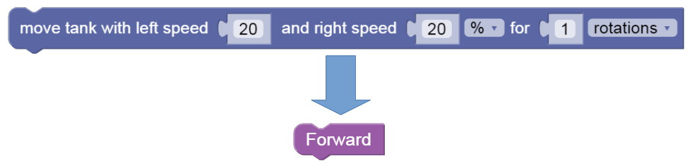

Abstraction with Functions
---

You might have gotten very good at remembering how to solve a maze, and which pattern of Move Tank is Forward, and which is Back, and which is Left or Right.

But you might have seen it gets quite hard to solve larger more complex problems, if you have to remember and keep track of so many details.

You can use **Abstraction** to simplify things and hide some of those details:

## Abstracting Statements

Which is easier to read?

So, how do we create these abstractions?

## Create Functions

### 1. Get a Function Block

### 2. Give Function the abstract Name

### 3. Move your complex Code Block into Function Definition

### 4. Find the newly created Function Block under Functions 

### 5. Move the new Function Block into the correct place in your code 

## Challenge

- Solve [this maze](https://gears.aposteriori.com.sg/index.html?worldJSON=https%3A%2F%2Ffiles.aposteriori.com.sg%2Fget%2F2htL3iLGey.json&filterBlocksJSON=https%3A%2F%2Ffiles.aposteriori.com.sg%2Fget%2FsRCnSgcwKF.json) again, with Abstracted Functions for *Forward* and *Right*

