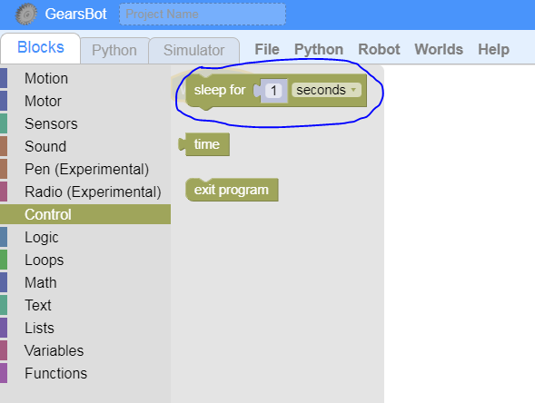

Pause, Sleep, Rest
---

Sequential programs sometimes require that your robot take a break, pausing for some other actions.

It's like standing at a red light.

In order to tell your robot to take a break, you need to pause the sequential operation for some time.

## Sleep Block

The *Sleep Block* under the *Control* Blocks category will do just that.

**Challenges:**

Use [THIS LINK](https://gears.aposteriori.com.sg/index.html?worldJSON=https%3A%2F%2Ffiles.aposteriori.com.sg%2Fget%2FM9YRPKGWt7.json&robotJSON=https%3A%2F%2Ffiles.aposteriori.com.sg%2Fget%2F7r9K65arhz.json&filterBlocksJSON=https%3A%2F%2Ffiles.aposteriori.com.sg%2Fget%2Fo22H2evjjT.json) to add Sleep into your code.

- Go back and forth like before, but add a 1 second stop between each direction

## Test

- Load [this version of GearsBot](https://quirkycort.github.io/gears/public/index.html?worldJSON=https%3A%2F%2Ffiles.aposteriori.com.sg%2Fget%2FUPL7UbfCnF.json&robotJSON=https%3A%2F%2Ffiles.aposteriori.com.sg%2Fget%2F7r9K65arhz.json&filterBlocksJSON=https%3A%2F%2Ffiles.aposteriori.com.sg%2Fget%2Fo22H2evjjT.json&worldScripts=world_challenges)

- Click on *Simulator Tab* to see Challenge

- Follow instructions and note down the *special Code* after doing the challenge successfully!

## Computational Thinking Hints

Remember some of the processes that can help you think like a robot:

### Decomposition - Break the problem down into little bits

You need:

- a block to move forward
- a block to pause

### Abstraction

Figure out the degrees/rotations/time needed to move forward to the first rest stop.  

Once you have that you can forget about all the numbers in that move forward block. 

### Pattern Recognition

Note that the space between each rest stop is the same... you can probably reuse that forward block.  

The rest can be the same length of time, so also can ruse!

### Algorithmic Thinking

Try to write down in English what you need to do:

- Move forward
- Wait
- Move forward again
- Wait
- Move forward again
- Wait

This is the plan...
