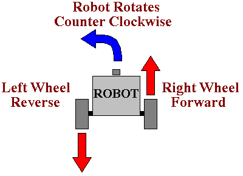

Sharp Turns
---

Being able to make turns is an important part of driving a particular path.

In this section we will be exploring how to make turns.

---

## Right

To turn in either direction you will need to vary the direction and/or speeds of the two motors.

For instance to turn right, you can rotate the left tire forward and the right tire backward at the same speed:

---
## Left

Similarly, to turn left, you reverse and rotate left tire back, and right tire forward.
  

## It's Your Turn!

Load [THIS LINK](https://gears.aposteriori.com.sg/index.html?worldJSON=https%3A%2F%2Ffiles.aposteriori.com.sg%2Fget%2FM9YRPKGWt7.json&robotJSON=https%3A%2F%2Ffiles.aposteriori.com.sg%2Fget%2F7r9K65arhz.json&filterBlocksJSON=https%3A%2F%2Ffiles.aposteriori.com.sg%2Fget%2Fo22H2evjjT.json)

Use the same Move Tank block to try and make a perfect *left turn*.  

You'll need to decide on which wheel to move fwd/back or keep off, and you will need to do some trial and error on the number of rotations.

<video autoplay muted loop width=450 height="auto">
  <source src="images/codeLeftTurn.mp4" type="video/mp4">
</video>

**Challenges:**

- Turn Left 4 times, until your'e back to the same position

- Turn Left, then turn right back to the same position

## Test 

- Load [this version of GearsBot](https://quirkycort.github.io/gears/public/index.html?worldJSON=https%3A%2F%2Ffiles.aposteriori.com.sg%2Fget%2FMLrEZXWzdo.json&robotJSON=https%3A%2F%2Ffiles.aposteriori.com.sg%2Fget%2F7r9K65arhz.json&filterBlocksJSON=https%3A%2F%2Ffiles.aposteriori.com.sg%2Fget%2FsbVQLkhtDr.json&worldScripts=world_challenges)

- Click on *Simulator Tab* to see Challenge

- Follow instructions and note down the *special Code* after doing the challenge successfully!

## Computational Thinking Hints

Remember some of the processes that can help you think like a robot:

### Decomposition - Break the problem down into little bits

You need:

- a block to move forward
- a block to turn left
- a block to turn right

### Abstraction

Figure out the degrees needed to turn left exactly.

Once you have that you can forget about all the numbers in that block - just think of it as a Turn Left block - you can duplicate it if you need to turn left more than once.

### Pattern Recognition

Do the same for a block to turn right. 

It should look similar to your left turn block - just reverse which wheel goes forward and which goes back.

### Algorithmic Thinking

Try to write down in English what you need to do:

- Turn Left
- Move Forward past zombies
- Turn Right
- Move Forward past zombies
- Turn Right
- Move Forward
- ... what's next?

Finish writing the full plan - this is roughly how many blocks of code you will need.

You can also see if you can reuse some of the blocks (duplicate).