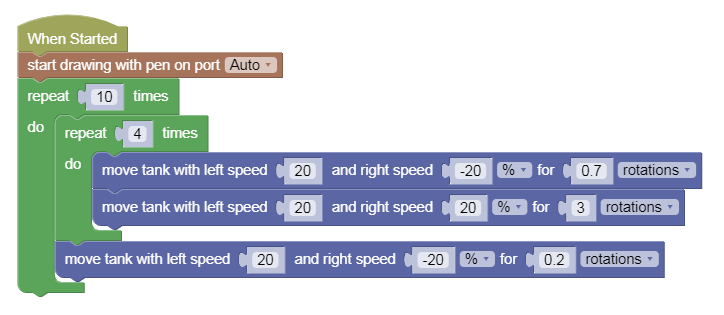

Painting Challenges 2
---

Let's get back to our Pen & Paper, and use what we've learned to paint some circles and arcs.

- [Challenge 5: Circle](https://gears.aposteriori.com.sg/index.html?worldJSON=https%3A%2F%2Ffiles.aposteriori.com.sg%2Fget%2F9rFHUxNujo.json&robotJSON=https%3A%2F%2Ffiles.aposteriori.com.sg%2Fget%2F7r9K65arhz.json&filterBlocksJSON=https%3A%2F%2Ffiles.aposteriori.com.sg%2Fget%2FPF3yEFnGLA.json)

## Challenge Yourself!

What kind of image can you draw?

You can use the [Art Canvas](https://gears.aposteriori.com.sg/index.html?worldJSON=https%3A%2F%2Ffiles.aposteriori.com.sg%2Fget%2FTMViLrcroR.json&robotJSON=https%3A%2F%2Ffiles.aposteriori.com.sg%2Fget%2F7r9K65arhz.json&filterBlocksJSON=https%3A%2F%2Ffiles.aposteriori.com.sg%2Fget%2FJuVPFtgZef.json) world to explore your robot's artistic talents.

NOTE: We've added some Loops, Functions, and Math in case you find it useful to make your creations!

## Loop Example

Try to code this in and see what your robot draws - might need a little patience!

- The inner loop is drawing squares: 4 x straight + turn
- The outer loop is saying to draw 10 of those squares, but each time twist the starting angle a bit...

## Sharp & Soft Turns mixed!

- You can try this!

<video autoplay muted loop width=450 height="auto">
  <source src="images/arcs.mp4" type="video/mp4">
</video>