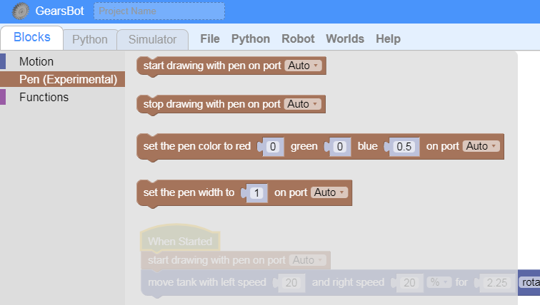
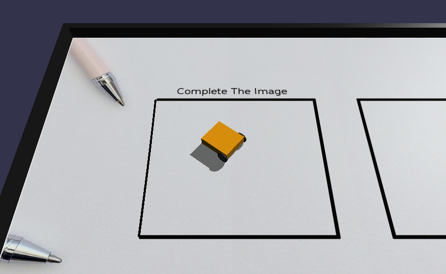

Painting Challenges
---

Now we are going to use our Robot to do complete some paintings.

In order to do that we have to use the special robot Pen we have.

The two main functions are:

- Start Drawing: starts ejecting ink from pen tip
- Stop Drawing: stops ejecting ink

We can also mess around with the type of ink and how much of it to shoot out in order to make wider or thinner lines...

- Set Pen Color
- Set Pen Width

## Simple Line

Let's start with [Challenge 1](https://gears.aposteriori.com.sg/index.html?worldJSON=https%3A%2F%2Ffiles.aposteriori.com.sg%2Fget%2FmuLhbPuWYH.json&robotJSON=https%3A%2F%2Ffiles.aposteriori.com.sg%2Fget%2F7r9K65arhz.json&filterBlocksJSON=https%3A%2F%2Ffiles.aposteriori.com.sg%2Fget%2Fq6jnF3GLcP.json).

- Complete the Image

### Extra Challenge

- After completing the image lift the pen and drive into the middle of the box, like this:

## Lines with Turns

- [Challenge 2](https://gears.aposteriori.com.sg/index.html?worldJSON=https%3A%2F%2Ffiles.aposteriori.com.sg%2Fget%2F6QLtZMM499.json&robotJSON=https%3A%2F%2Ffiles.aposteriori.com.sg%2Fget%2F7r9K65arhz.json&filterBlocksJSON=https%3A%2F%2Ffiles.aposteriori.com.sg%2Fget%2Fq6jnF3GLcP.json)

- [Challenge 3](https://gears.aposteriori.com.sg/index.html?worldJSON=https%3A%2F%2Ffiles.aposteriori.com.sg%2Fget%2F7GE9KWucDy.json&robotJSON=https%3A%2F%2Ffiles.aposteriori.com.sg%2Fget%2F7r9K65arhz.json&filterBlocksJSON=https%3A%2F%2Ffiles.aposteriori.com.sg%2Fget%2Fq6jnF3GLcP.json)

- [Challenge 4: Triangle](https://gears.aposteriori.com.sg/index.html?worldJSON=https%3A%2F%2Ffiles.aposteriori.com.sg%2Fget%2FtcygQfcnB4.json&robotJSON=https%3A%2F%2Ffiles.aposteriori.com.sg%2Fget%2F7r9K65arhz.json&filterBlocksJSON=https%3A%2F%2Ffiles.aposteriori.com.sg%2Fget%2Fq6jnF3GLcP.json)

## What can you draw?

 Use [this canvas](https://gears.aposteriori.com.sg/index.html?worldJSON=https%3A%2F%2Ffiles.aposteriori.com.sg%2Fget%2FtcygQfcnB4.json&robotJSON=https%3A%2F%2Ffiles.aposteriori.com.sg%2Fget%2F7r9K65arhz.json&filterBlocksJSON=https%3A%2F%2Ffiles.aposteriori.com.sg%2Fget%2Fq6jnF3GLcP.json) to draw anything you'd like!

<video autoplay muted loop width=450 height="auto">
  <source src="images/house.mp4" type="video/mp4">
</video>

## Abstract Art Challenge

- Whatever you choose to paint (a pentagon, a house, a letter), create a Function for painting that shape, like **PaintShape**

- Paint this shape 2-3 times in different areas of the canvas
  - Paint
  - Drive away to a new starting point
  - (optional) Choose a different color
  - Paint 
  - Reapeat as many times as you wish...

- Take a screenshot of your final work of art!

If you need a bigger canvas use [this](https://gears.aposteriori.com.sg/index.html?worldJSON=https%3A%2F%2Ffiles.aposteriori.com.sg%2Fget%2FjXAbM6kDJN.json&robotJSON=https%3A%2F%2Ffiles.aposteriori.com.sg%2Fget%2F7r9K65arhz.json&filterBlocksJSON=https%3A%2F%2Ffiles.aposteriori.com.sg%2Fget%2Fq6jnF3GLcP.json)