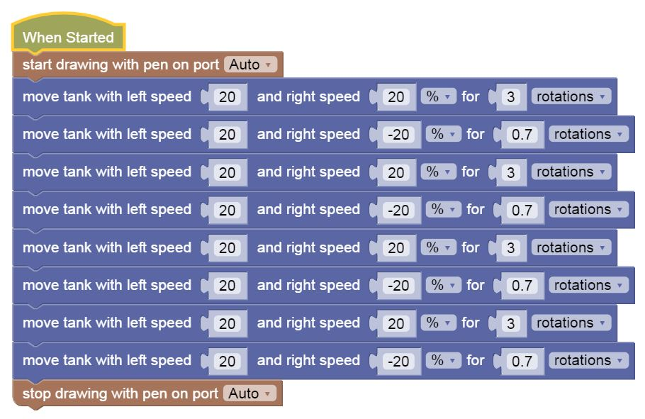
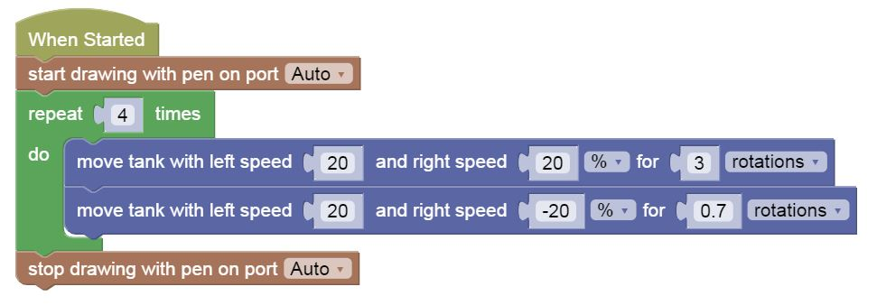

Painting With Loops
---

## Loops

Let's look at the sequence for drawing a square from scratch:

- Put Pen Down
- Go Forward For 3 Rotations
- Turn Right
- Go Forward For 3 Rotations
- Turn Right
- Go Forward For 3 Rotations
- Turn Right
- Go Forward For 3 Rotations
- Turn Right
- Lift Pen Up

Do you **recognize any pattern** here?  

Is anything **repeating** over and over?

- Put Pen Down
- **Go Forward For 3 Rotations**
- **Turn Right**
- Go Forward For 3 Rotations
- Turn Right
- Go Forward For 3 Rotations
- Turn Right
- Go Forward For 3 Rotations
- Turn Right
- Lift Pen Up

Those 2 lines are repeating 4 times...

When you detect patterns like these that repeat you can use **Loops** to simplify your code, so that the above becomes:

- Put Pen Down
- **Repeat 4 Times**
    - Go Forward For 3 Rotations
    - Turn Right
- Lift Pen Up

See the same transformation in Gears code blocks:

Can be simplified as:

## Practice

- You can try the above with [this canvas](https://gears.aposteriori.com.sg/index.html?worldJSON=https%3A%2F%2Ffiles.aposteriori.com.sg%2Fget%2FtcygQfcnB4.json&robotJSON=https%3A%2F%2Ffiles.aposteriori.com.sg%2Fget%2F7r9K65arhz.json&filterBlocksJSON=https%3A%2F%2Ffiles.aposteriori.com.sg%2Fget%2FAMz9cNzMJm.json)

- You can try to paint other polygons (triangle, pentagon, hexagon) - what changes do we need to make to our blocks to add sides to our shape?