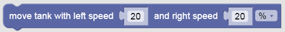

Color Sensor - Wait Until
---

The Color Sensor can tell what color it is looking at.  

If it is pointing at an area that has more than one color, it could get confused. 

So, we usually only use it when it is really close up against a very distinct color area.

For instance, note how close to the floor we usually mount our color sensor:

## Color Sensor - Test 1 

- Load [this challenge](https://quirkycort.github.io/gears/public/index.html?worldJSON=https%3A%2F%2Ffiles.aposteriori.com.sg%2Fget%2FaMbsTTPDUo.json&filterBlocksJSON=https%3A%2F%2Ffiles.aposteriori.com.sg%2Fget%2FNNCXg4pVKe.json&worldScripts=world_challenges)

- Click on *Simulator Tab* to see Challenge

- <ins>**NOTE**</ins>: Sensor challenges will be **randomized**.  Every time you press the *RESET* button, the world will change a bit.  This makes sure you are really using the sensor, and not counting on some special magic distance...

- **HINTS**

  - We added Start Moving and Stop Moving blocks.  When you don't know how far you need to move, it's best to use these over the ones that move for a specific distance/time.

    

    

  - We also added a "Wait Until" block that can be used to decide when to stop:

    

  - You will need to compare what the Sensor "sees" to some expected color, like Red in this case.  Here is a way to do it:

    

- Follow instructions to complete the challenge and take a screenshot with your *Completion Code*.

## Color Sensor - Test 2

- Load [this challenge](https://quirkycort.github.io/gears/public/index.html?worldJSON=https%3A%2F%2Ffiles.aposteriori.com.sg%2Fget%2FXgixT3qLEk.json&filterBlocksJSON=https%3A%2F%2Ffiles.aposteriori.com.sg%2Fget%2FNNCXg4pVKe.json&worldScripts=world_challenges)

- Click on *Simulator Tab* to see Challenge

- **HINT**: This time you have to wait until you see the bridge before moving...

- Follow instructions to complete the challenge and take a screenshot with your *Completion Code*.
