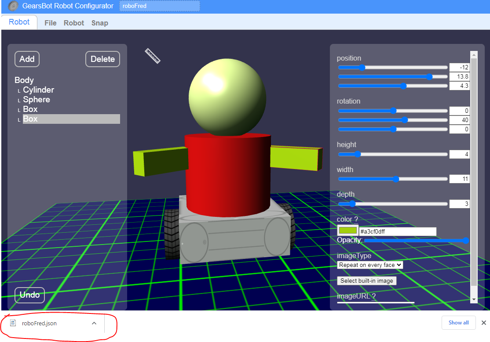

Basic Shapes
---

Next we want to anthropomorphize our robot!

That's a big word that just means make it look a bit more alive, like us.

So let's not worry about making legs and hands that work, but let's add a body on top of the base that looks a little more human.

Like this:

As you can see, we've added the following basic shapes to the Body:

- Cylinder (chest)
- Sphere (head)
- 2 Boxes (arms)

## Practice

This can take a while to get good at manipulating the shapes to the shape and location and orientation you want.

Every time you make a move by mistake that you don't like, remember you can just press Undo on the bottom left...

Spend some time trying to make your robot.
Add any shapes you'd like!

If you finish quick, why not add:

- Some facial features, like eyes, nose, and lips?  
- Or crazy hair?  
- Or some buttons for its vest...

Note that because we've added our shapes to the **Body**, they will all move with Body in the simulator, no matter whether there are air gaps between them...

## Save 

Let's save our new robot and load it into our simulator:

- Change the name of your robot on the top left
- Then click File -> Save to File

Usually you will need to drag and drop the new file to its rightful location...

Best if you can put it in your login Student folder, so you can find it easily in a bit.

## Load 

Now, let's open the regular [GearsBot](http://a9i.sg/gears) and click on **Simulator**.

See it's still our old robot... Now we want to load our new robot design into this world.

Click Robot -> Load from File, and select the same file you just saved.

Once you've loaded, your new robot will be imported into the Simulator world with all its physics in place.  You might notice some strange behavior if you didn't build your robot properly.

For instance, in the above example of RoboFred, we put the wheels at the center of the robot, and left the caster in the back, but didn't account for anything to balance the front:

Oops...

## Keep Desigining & Testing

Keep designing your robot until you're satisfied.

Try to add some Movement code blocks to drive your new robot around in the simulator world.

You can use the joystick too!