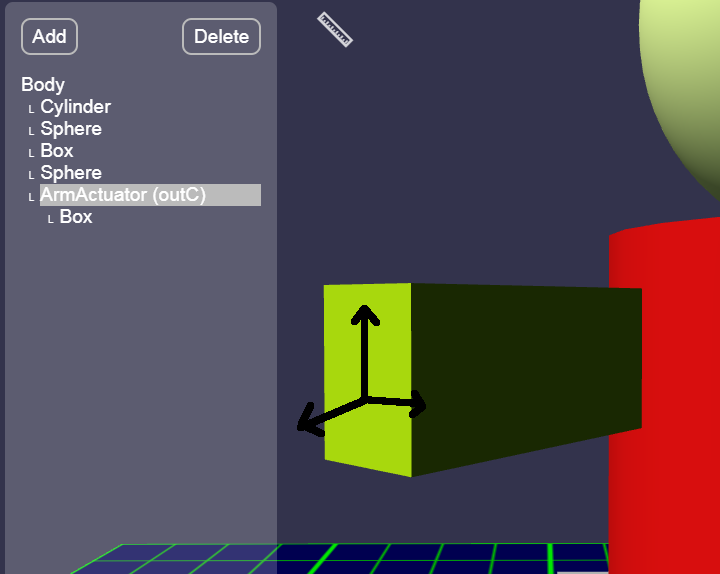

Arm Actuator
---

As we already learned, **actuators** are electromechanical parts on your robot that can effect changes in the physical environment.

For instance, a **motor** can make your robot's wheels spin, or wave its hand, or swivel its head.

Other types of actuators might **create light or sound**.

And yet other types might do other strange things, like turn on a magnetic field or paint color on the floor under the robot!

We are going to add an Arm Actuator to our robor, so we can control its arms!  

You could use an Arm Actuator to control other parts, like a crane or a door or anything that can rotate around a pivot.

<video autoplay muted loop width=100% height="auto">
  <source src="images/wave.mp4" type="video/mp4">
</video>

Arm Actuators most closely simulate a simple [servo motor](https://www.youtube.com/watch?v=1WnGv-DPexc).

## Adding an Arm Actuator

Let's go back to our [Robot Configurator](https://gears.aposteriori.com.sg/configurator.html).

Where we now have boxes for arms, we are going to stick arm actuators.

When we add actuators we cannot add them to our basic shapes, so we have to add them to the Body or other Actuators.

So let's add an **Arm Actuator** to the body, but place it near the chest, where the arms come out - for RoboFred, that's the big red cylinder.

When you add the **Arm Actuator**, the default location will likely be hillarious, and everyone will scream and giggle!

So, I quickly move it to the left of my robot:

<video autoplay muted loop width=100% height="auto">
  <source src="images/addarmactuator.mp4" type="video/mp4">
</video>

You can see how the actuator's arm will be rotating.

## Positioning & Rotating 

You can change the actuator's rotation so that the arm could have a different arc relative to your robot.

In this sample case, our arms are coming out **40 degrees** angle to the chest, so we will make the Arm Actuator also come out at 40 degrees.

Notice that when you move the actuator, it's arm follows. 

<video autoplay muted loop width=100% height="auto">
  <source src="images/movearmactuator.mp4" type="video/mp4">
</video>

The arm is more or less a guide for you to visualize how shapes connected to your actuator will behave.  But the arm itself cannot be resized other than length, so we will be adding another Box on top of it to replicate our arm...

When you add a Box to the Actuator, the Box will be in a relative position and rotation to the Actuator.  So when you move it along various axes it may move diagonally to the rest of the robot.

Try to get your arm actuator and the Arm shape (box for RoboFred) into a plausible location and rotation.  

Then Save & Load into the simulator.

In thr configurator, when you add an actuator, it will tell you which Motor Port controls it:

Since it says **outC**, we will use Motor (NOT Movement) code blocks to control this one motor with Port C:

Try adding blocks to wave (move arm up, then down).

## Adding More Arms

On your own add a second Arm Actuator to control the second arm.

Take your time.  

This is not easy!

You should be able to wave or otherwise control both arms separately by using various Motor blocks with port C and port D.

You can even make a walking robot, if you're so inclined:

<video autoplay muted loop width=100% height="auto">
  <source src="images/walker.mp4" type="video/mp4">
</video>

Ergh, that's going to need some work...