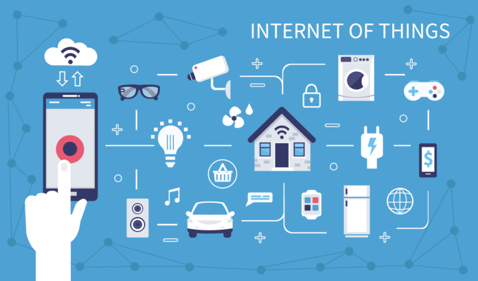
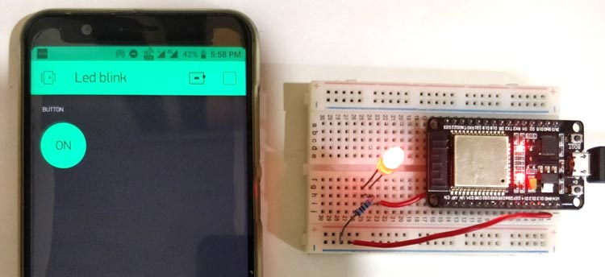

Course Overview
---

The **Internet of Things** is a multi-disciplinary subject.

In order to get a good grasp of Robotics, you need to understand:

- **Electronics**: how electrical circuits work
- **Coding**: the logic behind computer programs
- **Product Design & UX**: making effective user interfaces

Each of these disciplines normally requires years of university studies to master.  

This is NOT a University level course.

We are going to get a taste of all of the above, but all of the theory and much of the engineering will be hidden inside black boxes like pre-packaged phone apps, already-customized cloud IoT servers, and software drivers and development kits.

If anything, the main discipline we will be studying and exercising is **Systems Engineering**, which looks at best practices for integrating various parts into a working system.

We will be taking a bunch of common electronic recipes and various building blocks of software and building them on top of each other to create a unique final product - an IoT Smart Device for your home or business!

So, get ready to **design, connect, and code** as we begin our journey into the world of the

<h1>IoT - Internet of Things!</h1>
