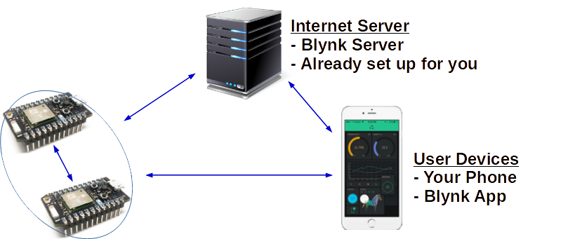

IoT Simulation
---

We will start with a simulation evironment.
This will introduce us to the 3 basic parts of an IoT enterprise solution:

- WiFi/Bluetooth-connected **micro-controller** & electronics
- IoT-customized **Cloud Servers**
- **Graphic User Interface** for monitoring and remote-controlling the electronics

For our IoT micro-controller we will be using the Espressif (ESP) family of development boards (namely, ESP8266 & ESP32).

For our IoT Cloud, we have a customized **Blynk** server in our office.

And for our GUI Dashboard, we will be using the Blynk Legacy application on our phones/tablets.

Of course, all of these devices must be connected to the internet at all times for things to work seemlessly.

---

## [Registration](https://iot.aposteriori.com.sg/register.html)

The registration link for the custom Blynk Service can be found **[here](https://iot.aposteriori.com.sg/register.html)**.

Please make sure to:

- Use an email you can easily get to on your laptop/phone/tablet
- Remember the password!

---

## Blynk App

The Blynk App to download to your phone/tablet is the LEGACY version of the app:

## [Android](https://play.google.com/store/apps/details?id=cc.blynk)

## [iOS](https://apps.apple.com/us/app/blynk-0-1-legacy/id808760481)

---

## Simulators

The IoT simulators can be found [here](http://a9i.sg/iot).

---

## Tutorial

The tutorial we will be following can be found **[here](https://drive.google.com/file/d/1d5hwjLO-iVDXsvBDGlXZhVAqJhPdgRGf/view?usp=sharing)**.
