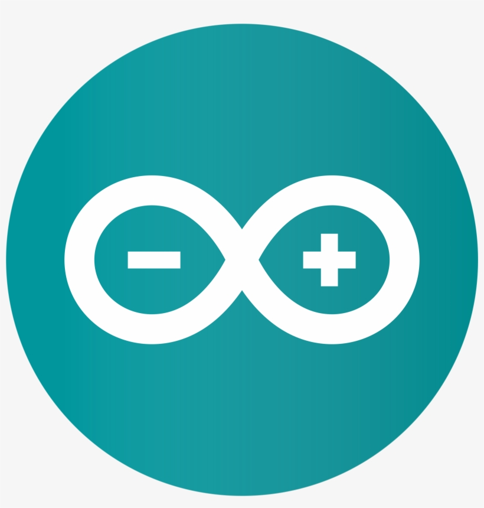

Using Real Electronics
---

Now that we have learned the basic ideas behind IoT technology, it's time to take our understanding into the real world, where things get a bit more complex, but way more fun!

**Things will not always work!**

That's ok - part of engineering and being a technologist is learning to find the source of a problem, and figuring out how to solve it with materials you have.

First, let's get acquainted with our board.
We've chosen one of the more ubiquitous and easily-available development kits on the market: Espressif's ESP32.

It's got:

- WiFi 
- Bluetooth
- Buttons
- LEDs
- USB connection for easy programming
- multi-us GPIO pins
- Built-in I2C & SPI support

In short - it can connect to and control a lot of electronics!

## Connect

First, let's make sure we can connect and program this micro-controller.

Use the short USB wire to connect the ESP32 to your laptop.  You should see a small LED light up.  That indicates the controller is connected to power.

## Arduino & Hello World/Blink

First, find the Arduino app on your laptop and bring it up:

Arduino is an open-sourced platform for programming micro-controllers.  We need to make sure it's setup to control your ESP32.

### Board Manager

First, open the **Prefences**:

And add the following to the Board Manager URLs list (copy and paste):

http://dl.espressif.com/dl/package_esp32_index.json

Click **OK** to close the Preferences.

Now navigate to **Tools->Board->Board Manager**.

Type "esp32" in the search box and install the ESP32 library:

Then follow the below image to pick the correct Board, NodeMCU 32-S:

### Choose Speed & COM Port

Make sure that a COM port is selected - it may already populate when you connect the board to the laptop:

If there's more than one choice, you may need to experiment to see which one is the correct one.

As for **Upload Speed**, leave it on whatever the default is.

### Test Program

Before we do anything IoT, let's write a simple test program we can use to see that we can easily change the behavior of our board.

We will just blink the built-in user-controlled LED.

You can copy this code into the Arduino Sketch area:

    // This is a comment
    // LED_BUILTIN is pin 2 on the ESP32
    // Uncomment below if your Arduino doesn't recognize LED_BUILTIN
    // int LED_BUILTIN = 2;

    // setup() function - called once, when ESP32 board is powered up / reset
    void setup() {
      // Set Pin 2 as an output I/O pin
      pinMode (LED_BUILTIN, OUTPUT);
    }

    // loop() function - called over and over so long as ESP32 is running
    void loop() {
      // Turn power on in Pin 2
      digitalWrite(LED_BUILTIN, HIGH);
      // Wait 1000msec (1sec)
      delay(1000);
      // Turn power off in Pin 2
      digitalWrite(LED_BUILTIN, LOW);
      // Wait 1000msec (1sec)
      delay(1000);
    } // and repeat...

Next, compile the program to make sure you followed the above instructions properly:

## Compile & Upload

See instructions <a href="../20-Getting-Real/15-Compile-and-Upload.html" target="_blank">here</a>

## Test

After that you should start seeing a new LED light blinking on your board.

You can mess around with the **delay()** times to make the LED flash longer or more frequently, just to get comfortable with the programming environment.