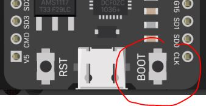

Compile & Upload
---

Next, compile the program to make sure you followed the above instructions properly:

### Compile

It will ask you to save the file if you haven't yet.  You can call it whatever you want...

If there are no errors, proceed.
If there are errors, see if you can fix them on your own, and if not, call an instructor to help you.

Finally, it's time to upload the program:

### Upload

**IMPORTANT NOTE - BOOT MODE**

Every time you Upload a program to the ESP32, you have to click and hold the small Boot button next to the mini-USB connector.

*The buttons may be labelled differently on your board, but it should be the same side as shown here.*

This puts the board into programming mode.

Hold the button until the Arduino log says it passed the connection part:

    Connecting........___   <----
    Chip is ESP32-D0WDQ6 (revision 1)
    
    ...
    <bunch of other logs>
    ...
    
    Leaving...
    Hard resetting via RTS pin...