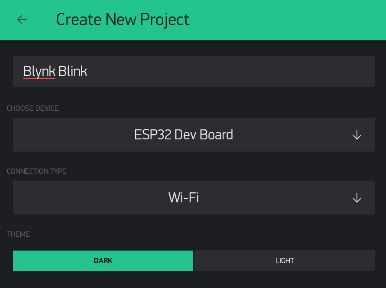
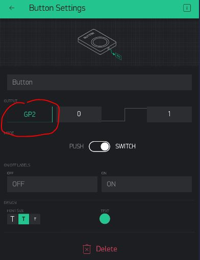
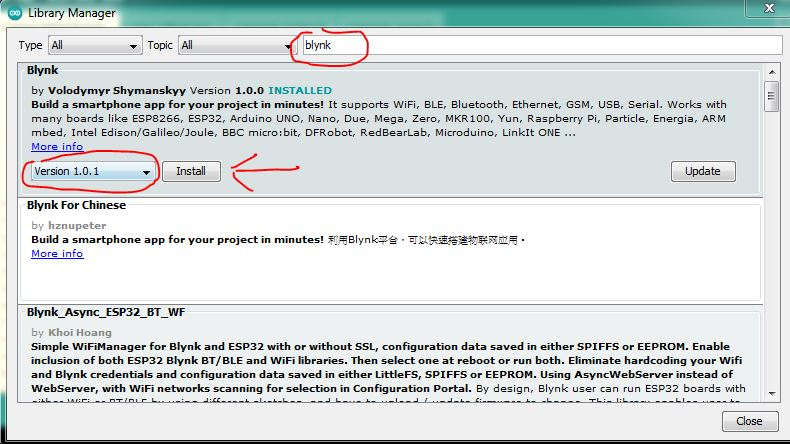
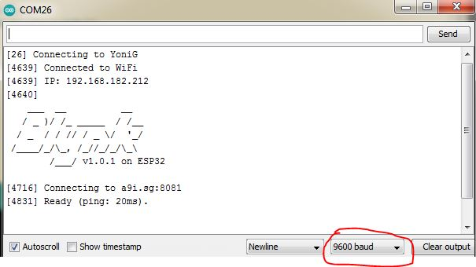

Blynk Blink
---

If you managed to make your on-board LED blink, that's cool!

But, now we want to try to control that LED from your phone/tablet using IoT technology.

### The Blynk Dashboard - Real Pins

In your phone/tablet, create a new project choosing *ESP32 Dev Board* and *Wi-Fi*:

Create the project, and add a button, but this time, instead of a Virtual Pin, let's just make this control our GPIO Pin 2 directly:

### Blynk Library

OK, back to Arduino on your laptop.

First, we will need to add the Blynk library, so you can use its API to connect to our Blynk server and communicate with your Blynk dashboard.

Head to **Tools -> Manage Libraries.. **

Search for Blynk and install **version 1.0.1**

### Blynk Program

We now need to change our ESP32 program to:

- Connect to WiFi
- Establish a connection to Blynk Server
- Connect to our Blynk Dashboard
- And that's it...

You can copy this code into the Arduino Sketch area:

    #define BLYNK_PRINT Serial
    #include <BlynkSimpleEsp32.h>

    // See Auth Token in email from Blynk...
    char auth[] = "YourAuthToken";

    // Your WiFi credentials.
    // Set password to "" for open networks.
    char ssid[] = "YourNetworkName";
    char pass[] = "YourPassword";

    void setup() {
      // Debug console
      Serial.begin(9600);

      Blynk.begin(auth, ssid, pass, "a9i.sg", 8081);
    }

    void loop() {
      Blynk.run();
    }

## Compile & Upload

Same as in the past modules.

See instructions <a href="../20-Getting-Real/15-Compile-and-Upload.html" target="_blank">here</a>

## Test

After that, if you provided the correct SSID, Password, and Auth Token you should see your Blynk dashboard warning light turn off, and the GP2-controlling button should be able to turn the small on-board LED on and off!

If something doesn't seem to work, or if you just want to see some logs from your board, try opening the **Serial Monitor** to see if the board reports any issues or if it's getting stuck in a particular place:

## Debug

Make sure your monitor's serial speed matches the one you set in the code:

      Serial.begin(9600);

You have now integrated your first real-world IoT system!