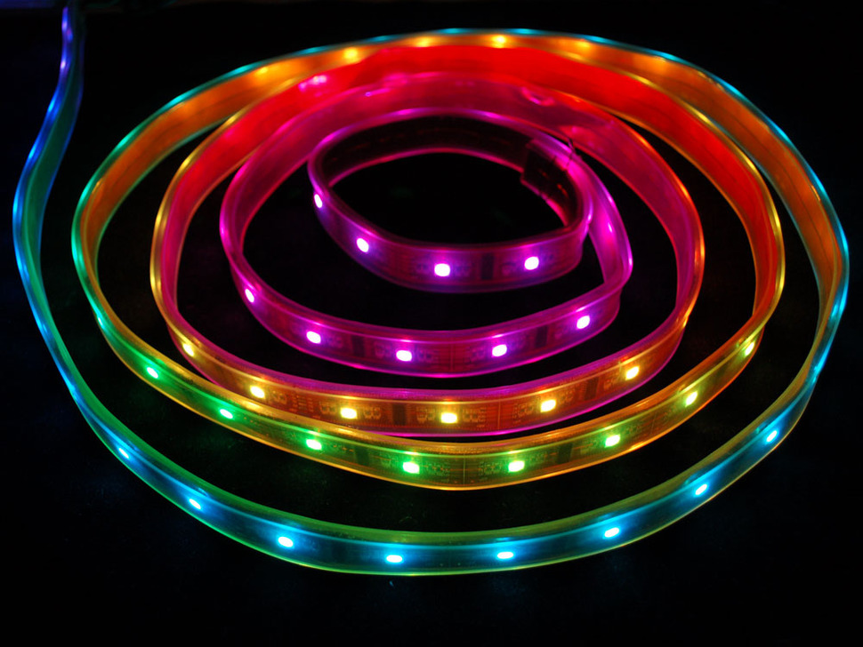
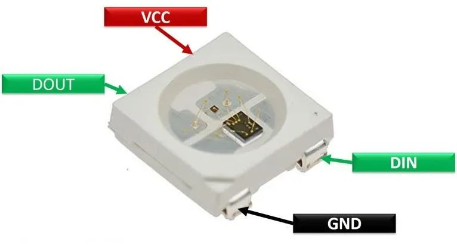

RGB Strip - Introduction
---

To connect an RGB Strip to our board, we need to find our RGB Strip and identify some pins.

Normally, RGB LED strips come in long rolls like this:

But we have cut these into short strips with 6 LEDs:

Each LED on the strip looks something like this:

VCC means +Voltage, GND is 0V.  So if I plug +3V to VCC and GND to GND, I would be supplying +3Volts gradient for the LEDs.  We will be using the +5V ESP32 pin as an input to VCC in order to supply +5V.

There are several GND pins on the ESP and either can be used as input to GND on the RGB strip.

Finally, we need a DIN, and you can use most General-Purpose IO (GPIO) pins for that.  In the example shown, I've used GP5:

## Blynk Dashboard

For this project, we will use the zeRGBa Widget in the Blynk dashboard:

This time we will make the widget control via a Virtual Pin, say V0.  Also make sure to use "Merge" type, so it will be 3 different parameters (Red, Green, Blue) all coming in through one virtual pin:

