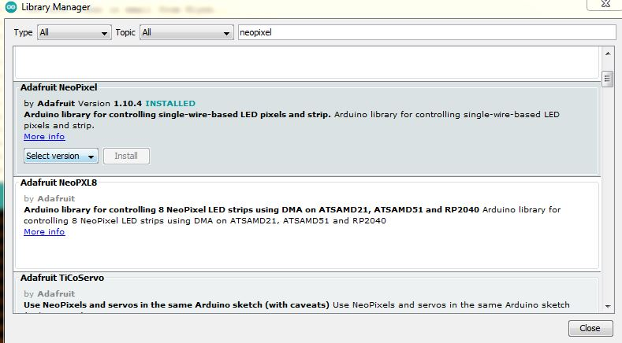

RGB Strip - Coding
---

Not all electronics have a simple ON/OFF or corralating Widget in Blynk.  This is one example that cannot be easily supported with just running Blynk.  We will need to add some more complex coding.

### RGB Strip API Library

First, let's find a suitable library to support controlling the RGB Strip. 

 It has some electronic communication protocol that is simple enough, but we won't be coding it from scratch!

In Arduino, go to *Tools -> Library Manager* and install Adafruit NeoPixel library (latest version):

### Test RGB Strip Control 

First, let's just make sure that we can control the RGB Strip without Blynk.

Add the following to the top of your basic Blynk sketch:

    #include <Adafruit_NeoPixel.h>

Now, let's define our RGB Strip anywhere between that line above and the setup() function:

    Adafruit_NeoPixel strip(6, 5, NEO_GRB + NEO_KHZ800);

This defines a 6-LED RGB Strip, contrlled by ESP32's PIN 5.

In Setup() function, add the following code:

    // Define red color
    uint32_t red = strip.Color(255, 0, 0);  // HIGH red, no green, no blue

    // for each of the six LEDs (index 0 thru 5)
    for(int c=0; c < strip.numPixels(); c += 1) {
    
      // Set LED/pixel 'c' to red
      strip.setPixelColor(c, red); 
    
    }

    // Now show the contents of the different LEDs as defined above
    strip.show(); 
  
Compile & Upload (see below) to get the LED strip to turn on.

If you can't get your LED's to turn on please make sure the pins are connected properly, the code compiles without errors, and that the upload is successful before getting help.

### Intercepting V0 Messages from Blynk

If you managed to control the RGB Strip and turn it some color (you can change the value of the color from red to something else using different RGB values), it's time to ty to control it from Blynk.

We will need to add an intercepting code for when Blynk tries to write some new RGB values to the board:

The code for this extra function is as follows:

    // Just says this is a WRITE/PUSH from Blynk dashboard for V0 virtual pin
    BLYNK_WRITE(V0)
    {
      // If you clicked *Merge* in the widget properties 
      // you will receive the different RGB levels as 3 parameters
      int R = param[0].asInt();
      int G = param[1].asInt();
      int B = param[2].asInt();

      // Create the RGB color type
      uint32_t color = strip.Color(R,G,B); 

      // for each of the six LEDs (index 0 thru 5)
      for(int c=0; c < strip.numPixels(); c += 1) {

        // Set LED/pixel 'c' to color
        strip.setPixelColor(c, color); 

      }

      // Now show the contents of the different LEDs as defined above
      strip.show(); 
    }

## Compile & Upload

Same as in the past modules.

See instructions <a href="../20-Getting-Real/15-Compile-and-Upload.html" target="_blank">here</a>

## Test

So now you should be able to change the color of the LEDs on the strip by running your Blynk dasshboard and choosing different colors from the zeRGBa widget!

Use all you've learned to make sure you've done everything right before getting help.

  