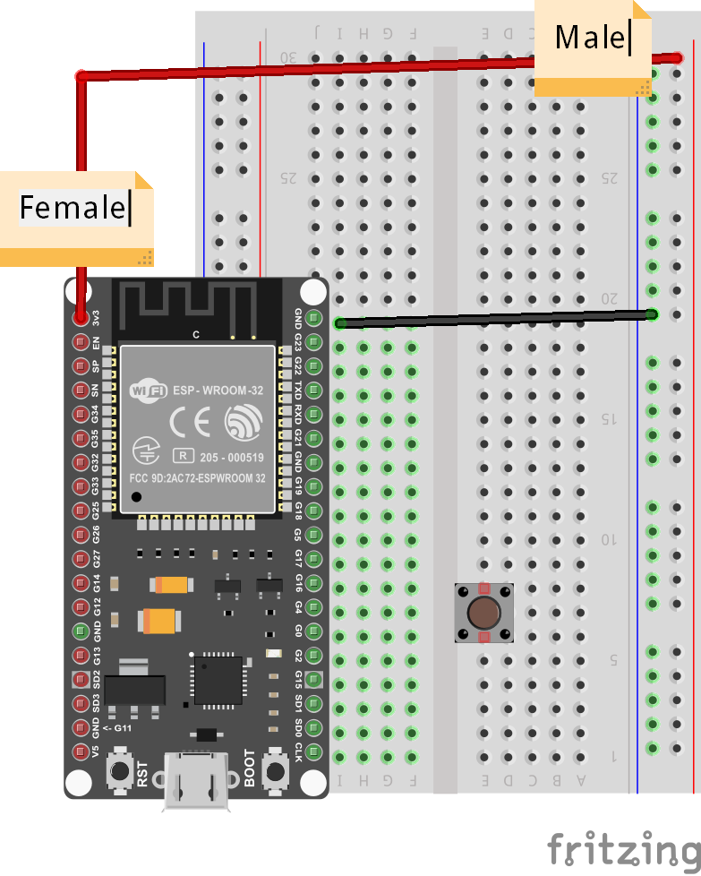

Smart Doorbell
---

In this project, we create a simple remote doorbell, using a push-button and the Blynk Notification widget.

## Notification Widget

The first step is to add the Notification widget to your dashboard:

Once it is added, you do not need to customize it or change its properties.  It is just a passive monitor of messages from the ESP32 board.
Pick a place for it on the dashboard and leave it there.

## Connecting the Button

### List of Parts

For this project you will need the following electronics from your kit beside the ESP32:

- Breadboard
- 2-Pin Push-Button
- Resistor
- 1 female-to-male jumper wires
- 4 male-to-male jumper wires

## Connect

First, get your breadboard ready:

It is upside-down on purpose.  I want Row 1 to be on the bottom.

Now, you need to attach the ESP32 to the breadboard.

Be **VERY CAREFUL** not to damage the pins when you do this:

- Line the pins up with the holes
  - The first pin from the bottom should be on row 1
  - The last pin on the top should be row 19
- One side of the board will be dangling in the air to the left of the breadboard
- Start pushing in from one end of the ESP slightly, then try to push from the other end of the ESP
- All the pins should be pushed into the holes from a perpendicular angle

Next, use a Female-to-Male jumper wire to connect the 3v3 (top left pin) from the ESP32 to the '+' column of the breadboard on the right hand side.

THen, use a Male-to-Male wire to connect the GND (top right pin) from the ESP32 to the '-' column on the right hand side.

The '+' may be the outermost column or the one just next to it.  Or there may be no markings.  Just pick one of those 2 outermost columns as (+) and one as (-) and connect as shown.

The wire colors are not important.

Now, carefully connect the 2-pin button such that one pin is on row 6 and the other on row 8 - it doesn't have to go exactly there, but for convenience and to avoid doubts just follow the example exactly.  IN theory, the pins show be anywhere as long as they are connected in different numbered-rows (same lettered column), and on the right side of the breadboard (not where the ESP32 is connected).  

Connect two more Male-to-Male wires as shown, from row 8 on the right (button) to row 7 on the left (GPIO Pin 4).  

The wire colors are not important.

Finally, connect row 8 (button) with a resistor to row 12.  You will need to bend the resistor legs to fit properly, and since the resistor is so thin, it may be hard to see where you are connecting it, so be extra-careful.

From row 12 where the resistor is connected, use your last Male-to-Male wire to connect the resistor back to '-', which is already connected to GND.

This completes our Smart Doorbell circuit.

Use the short USB wire to connect the ESP32 to your laptop to power it up.

## Coding

### Start with Blynk Blink code

Open the Arduino application.

See the basic code for [Blynk Blink](../20-Getting-Real/20-Blynk-Blink.html) - that will the starting point we assume for this project.

The code for Smart Doorbell needs to set Pin 4 as Input, so we need to add the following line to the setup() function:

    pinMode(4, INPUT);

Now, in the loop() function, we can start checking whether the button is pressed by checking the state of Pin 4.  You can add the following to the beginning of the loop() function - make sure it comes before the call to *Blynk.run()*:

    if (digitalRead(4)) {
      Blynk.notify("DOORBELL!");
    }

This will cause a Message Box with the String "DOORBELL!" to show up on our Blynk Dashboard.  If you want it to say something else, like "Someone at Front Door", or "Back Door Engaged" you can edit the notification text.

That's it!  All you have to do is compile and upload these changes.

## Compile & Upload

See instructions <a href="../20-Getting-Real/15-Compile-and-Upload.html" target="_blank">here</a>

## Test

After a successful upload you can test by clicking the button and seeing whether the Message Box with the notification text appears in your Blynk Dashboard.

If it doesn't, you can ask for help.

## Challenges & Showcases

- Try to connect the wires and mount the button in a way that makes the button less tangled up with wires

- See if you can attach the ESP32 to an external power source like a PowerBank charger and glue it to the outer doorframe of the classroom.  

- Show your teachers how the new Smart doorbell could work - in case a student is at the door or somewhere else in school and needs attention?  Like if the General Office desk is empty, and a student has an emergency - such a button could notify some of the admins to return to their stations ASAP!

- (ADVANCED) Try to wire up a second button to GPIO Pin 0 (just one below GPIO Pin 4).  In your code, you will need to set GPIO Pin 0 as INPUT, test for its state, and notify a different message.  Think of a scenario when 2 different notifications are appropriate and useful...