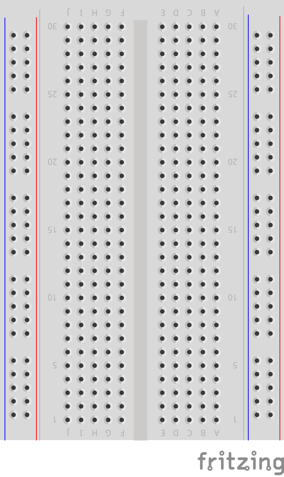

Intruder Alarm
---

In this project, we create a simple intruder alert, using an IR Proximity Sensor.  You can use the same technology to check on open doors or windows, or automate some manufacturing process.

## LED Widget

The first step is to add the LED widget to your dashboard:


Change the pin of the LED widget to associate it with an available Virtual Pin, say V0.

You can also change its color to make it red, as in a Red Flag.

Otherwise, it is just a passive monitor of messages from the ESP32 board.

Pick a place for it on the dashboard and leave it there.
You can resize it to be more obvious.


## Connecting the IR Proximity Sensor

### List of Parts

For this project you will need the following electronics from your kit beside the ESP32:

- Breadboard
- IR Proximity Sensor
- 1 female-to-male jumper wire
- 4 male-to-male jumper wires

## Connect

First, get your breadboard ready:



It is upside-down on purpose.  I want Row 1 to be on the bottom.

Now, you need to attach the ESP32 to the breadboard.

Be **VERY CAREFUL** not to damage the pins when you do this:

- Line the pins up with the holes
    - The first pin from the bottom should be on row 1
    - The last pin on the top should be row 19
- One side of the board will be dangling in the air to the left of the breadboard
- Start pushing in from one end of the ESP slightly, then try to push from the other end of the ESP
- All the pins should be pushed into the holes from a perpendicular angle


Next, use a Female-to-Male jumper wire to connect the 3v3 (top left pin) from the ESP32 to the '+' column of the breadboard on the right hand side.

Then, use a Male-to-Male wire to connect the GND (top right pin) from the ESP32 to the '-' column on the right hand side.

The '+' may be the outermost column or the one just next to it.  Or there may be no markings.  Just pick one of those 2 outermost columns as (+) and one as (-) and connect as shown.

The wire colors are not important.


Now, use the female-to-male connectors to connect as follows:

| IR Sensor | ESP32 / Breadboard
|----       | ----
| VCC       | '+' column
| GND       | '-' column  
| OUT       | GPIO PIN 15 (G15)


This completes our Smart Doorbell circuit.
Use the short USB wire to connect the ESP32 to your laptop to power it up.

## Coding

### Start with Blynk Blink code

Open the Arduino application.

We need to create an LED Widget variable that will be tied to the Virtual Pin V0 and control the Blynk app's LED we created in the dashboard.

    WidgetLED led(V0);

We will use Pin 15 to monitor the IR Sensor.
We need to do this on a recurring schedule, so we will need to create a timer as well.

BlynkTimer timer;

And we will need to set it to kickoff with our IR check code every so often:

      timer.setInterval(500L, blinkLedWidget);

This is the final code you will need:

```
#define BLYNK_PRINT Serial
#include <BlynkSimpleEsp32.h>

// You should get Auth Token in the Blynk App.
// Go to the Project Settings (nut icon).
char auth[] = "xxxx";

// Your WiFi credentials.
// Set password to "" for open networks.
char ssid[] = "xxxx";
char pass[] = "xxxx";

// The timer for checking the IR state
BlynkTimer timer;

// Control the LED widget via Virtual V0 from this variable
WidgetLED led(V0);

// This is the function we will call from our timer every so often
// It checks the state of GPIO Pin 15 (G15).
void blinkLedWidget() {

  // If the IR Sensor line is HIGH, it means there is nothing in front of it
  if (digitalRead(15)) {
    led.off();
  }
  else {
    led.on();
    delay(2000);  // Wait 2 seconds, so the user gets a clear signal
  }
}

void setup() { 
  // Set G15 as INPUT
  pinMode(15, INPUT);

  Serial.begin(9600);
  Blynk.begin(auth, ssid, pass, "a9i.sg", 8081);

  // Setup the timer to go off twice a second (every 500ms) 
  timer.setInterval(500L, blinkLedWidget);
}

void loop() {
  Blynk.run();
  timer.run();
}
```

That's it!  All you have to do is compile and upload these changes.

## Compile & Upload

See instructions <a href="../20-Getting-Real/15-Compile-and-Upload.html" target="_blank">here</a>

## Test

After a successful upload you can test by activating the IR Sensor by placing an object in front of it.

It should cause the LED on your dashboard to light up for 2 seconds.


If it doesn't, you can ask for help.

## Challenges & Showcases

- See if you can attach the ESP32 to an external power source like a PowerBank charger and glue it to the outer doorframe of the classroom.  

- Show your teachers how the new Intruder Alert could work - in case a student or some unwanted guest tries to sneak into their office?  They can get a message on their phone and ask school security to look into the matter ASAP!

- Or it can be used by parents to spy on their kids.   Make sure they stay at their desk doing homework...


- (MODERATE) Add code to also send a notification with sound alarm to the Blynk App - you will need to add the notification widget like in the Doorbell example.  

- (MODERATE) This setup can also be used to detect if a refrigerator door is kept open.  In that case it would also be useful to give an indication to whoever is forgetting to close the door by shining a light on the door to the remind them to close it.  You will need your RGB Strip or a single LED to create a warning light.  (it can even be done with the built-in LED on the ESP32)