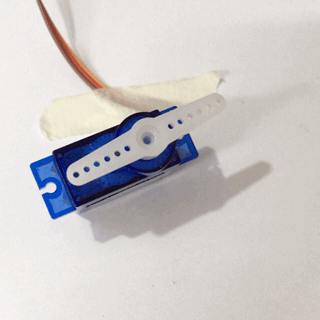
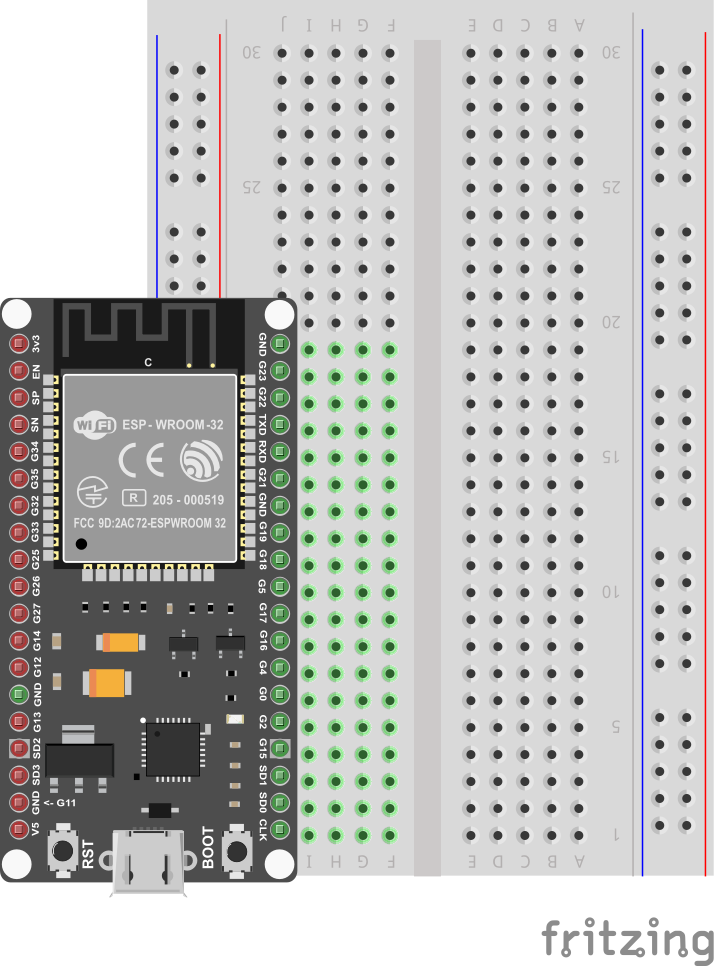
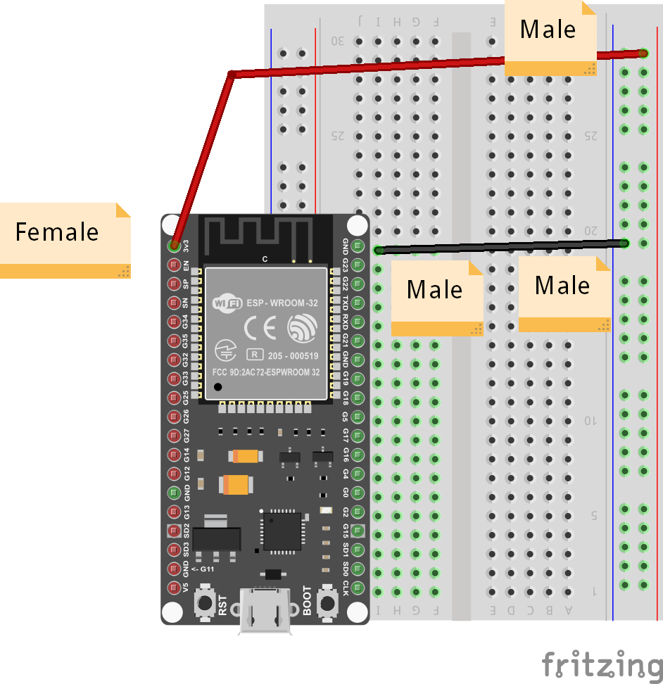
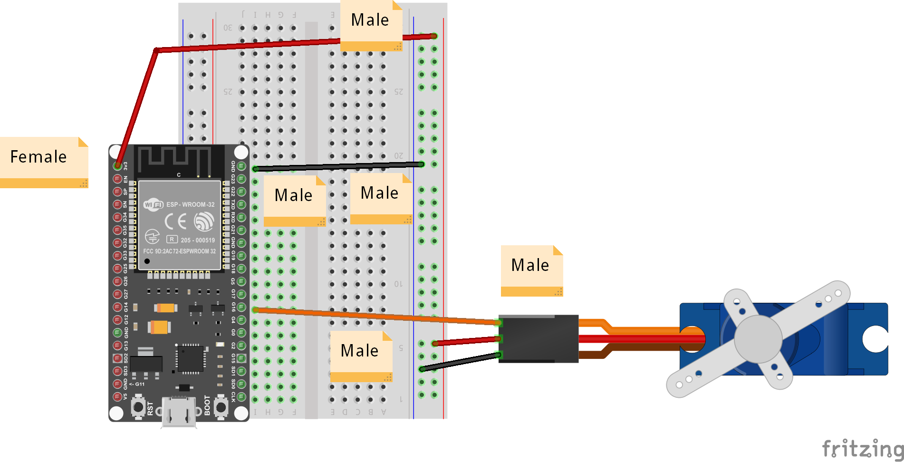

Remote-Controlled Motor
---

In this project, we create a simple remote controlled motor, using the Blynk Button widget and the SG90 Servo motor.



First, let's find the motor and assemble a rotating horn by just fitting one of the white horns provided onto the ribbed shaft.  It should make a tight fit and stay on quite well without much more than a push.

## Button Widget

Now let's add the simple Button Widget to the dashboard:


Once it is added, open its properties and:

- Set the PIN to an available Virtual Pin, say V0
- Change the Mode to Switch

 You can leave the other properties as-is, and later you can choose to play with them to see how it affects your project.

## Connecting the Button

### List of Parts

For this project you will need the following electronics from your kit beside the ESP32:

- Breadboard
- 1 female-to-male jumper wires
- 4 male-to-male jumper wires

## Connect

First, get your breadboard ready:


It is upside-down on purpose.  I want Row 1 to be on the bottom.

Now, you need to attach the ESP32 to the breadboard.

Be **VERY CAREFUL** not to damage the pins when you do this:

- Line the pins up with the holes
    - The first pin from the bottom should be on row 1
    - The last pin on the top should be row 19
- One side of the board will be dangling in the air to the left of the breadboard
- Start pushing in from one end of the ESP slightly, then try to push from the other end of the ESP
- All the pins should be pushed into the holes from a perpendicular angle



Next, use a Female-to-Male jumper wire to connect the 3v3 (top left pin) from the ESP32 to the '+' column of the breadboard on the right hand side.

Then, use a Male-to-Male wire to connect the GND (top right pin) from the ESP32 to the '-' column on the right hand side.

The '+' may be the outermost column or the one just next to it.  Or there may be no markings.  Just pick one of those 2 outermost columns as (+) and one as (-) and connect as shown.

The wire colors are not important.



Now, carefully connect the Servo's 3 pins such that the orange wire connects to G16 or row 8 on the breadboard.  The red wire goes to '+' column.  And the black wire goes to '-' or GND column.  You will need Male-to-Male wires for that.



This completes our Smart Doorbell circuit.

Use the short USB wire to connect the ESP32 to your laptop to power it up.

## Coding

### Start with Blynk Blink code

Open the Arduino application.

See the basic code for [Blynk Blink](../20-Getting-Real/20-Blynk-Blink.html) - that will the starting point we assume for this project.

The code for Remote Motor project needs to handle some Servo API, so put this at the top:

    #include <Servo.h>

And somewhere below all the #include lines, you can add the Servo variable like this:

    Servo servo;

We also need to set Pin 16 as Output, so we need to add the following line to the setup() function:

    pinMode(16, OUTPUT);

Now for starters we can test the Servo motor in the setup function itself, by adding:

```
// Set Servo to position 30 degrees
servo.write(30);
// Wait 1 second
delay(1000);
// Set Servo to position 180 degrees
servo.write(180);
// Wait 1 second again
delay(1000);
```

That should cause the motor to move to two different positions for 1 second each...

Now compile and upload these changes.

## Compile & Upload

See instructions <a href="../20-Getting-Real/15-Compile-and-Upload.html" target="_blank">here</a>

## Test

After a successful upload you can test by just letting teh program run and you can reset the board to test it again.

All you should see is the motor moving to two different positions for 1 second each.

If it doesn't, you can ask for help.

## Control Servo From Blynk

Now, we just need to add this extra function:

```
BLYNK_WRITE(V0) {

   if (param.asInt()) {
     servo.write(120);
   }
   else {
     servo.write(30);
   }

}
```

Compile, upload, and test again - see what happens when you click the button on and off.  It shoudl cause the motor to hold one of two positions depending on the state of the button.

## Challenges & Showcases

- (MODERATE) Add some mechanical hardware to your motor so it looks like it's a diroama of a:
    - garage door
    - carpark gantry
    - simple door

Show your teachers how you can control different aspects of a real world model with remote control using the Blynk app (a garage door opener from your phone, a remote way to open some malfunctioning carpark gantry, or a way to let the handyman into your home when you're away).

- (ADVANCED) Try to change the button to one of the Slider Widgets, and change the code so the Servo goes to whichever position the Slider tells it to.  


You should limit the values possible on the slider to the range available to the Servo (0-180).  What can you do with a more find-tuned remote control?  A balance game?  Control a robot arm?

- (ADVANCED) Try to wire up a second Servo, and use two Blynk buttons to control two servos.  Can you think of some cool project to use two servos in?  How about a remote control pinball game...