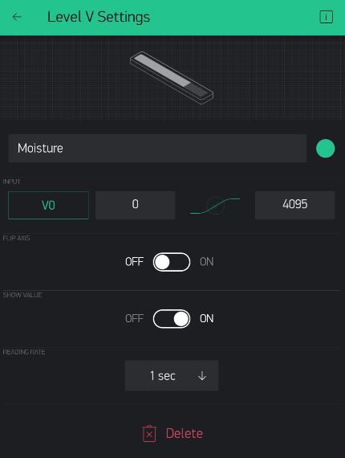
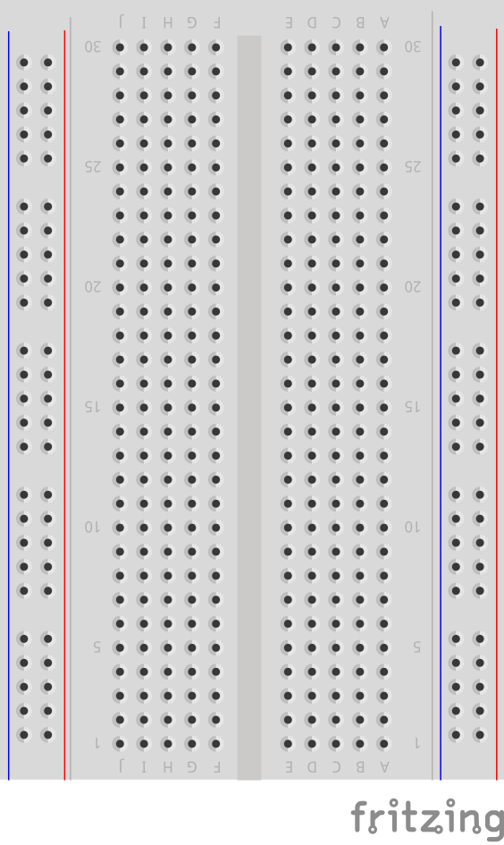
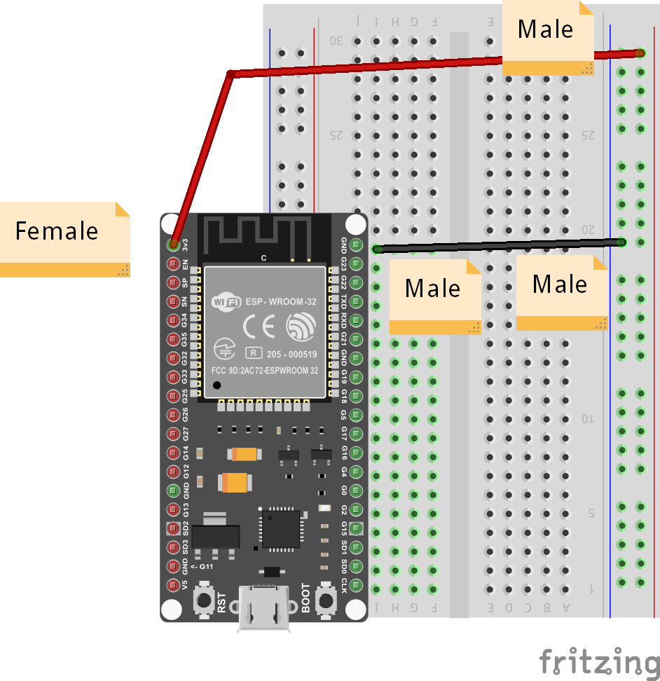
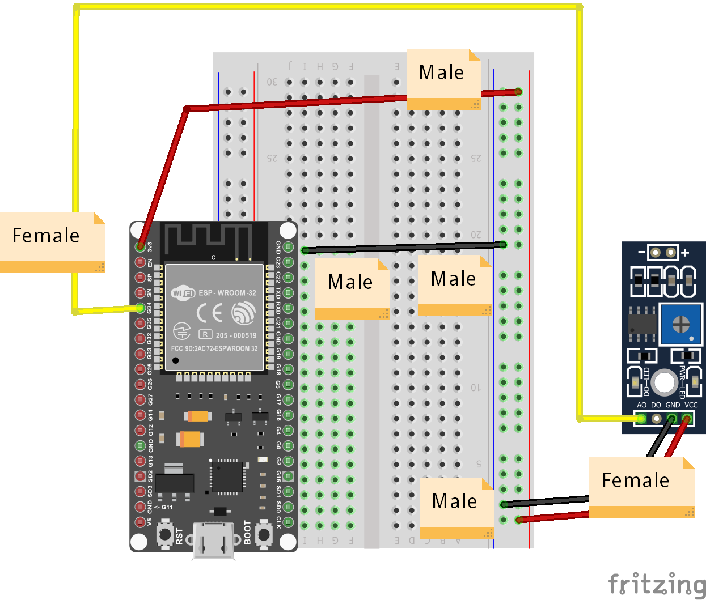
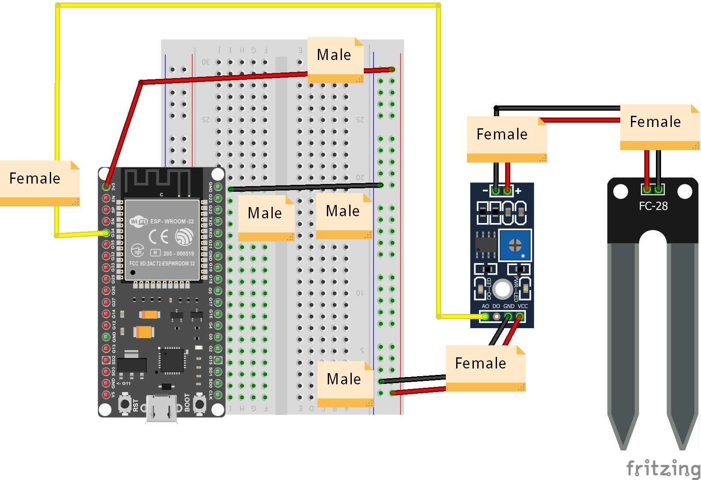

Smart Planter
---

Another way we can use IoT is to monitor and care for our plants and pets when we are not at home.

In this project, we will create the electronics necessary to create a Smart Planter, that can monitor its own soil moisture and keep us up to date.

## Level Widget

For the Planter, we can monitor the moisture level itself, so let's add a Level meter (Level H or Level V, up to you):

In the settings for the Level widget:

- choose an available Virtual Pin (say V0)
- Change the Max Value to 4095
- keep it at 1 Sec Reading Rate

## List of Parts

For this project you will need the following electronics from your kit beside the ESP32:

- Breadboard
- Moisture Sensor
- Moisture Sensor Board
- 3 Female-to-Female Connectors
- 3 Male-to-Female Connectors
- 1 Male-to-Male Connector

## Connect

First, get your breadboard ready:

It is upside-down on purpose.  I want Row 1 to be on the bottom.

Now, you need to attach the ESP32 to the breadboard.

Be **VERY CAREFUL** not to damage the pins when you do this:

- Line the pins up with the holes
    - The first pin from the bottom should be on row 1
    - The last pin on the top should be row 19
- One side of the board will be dangling in the air to the left of the breadboard
- Start pushing in from one end of the ESP slightly, then try to push from the other end of the ESP
- All the pins should be pushed into the holes from a perpendicular angle

Next, use a Female-to-Male jumper wire to connect the 3v3 (top left pin) from the ESP32 to the '+' column of the breadboard on the right hand side.

Then, use a Male-to-Male wire to connect the GND (top right pin) from the ESP32 to the '-' column on the right hand side.

The '+' may be the outermost column or the one just next to it.  Or there may be no markings.  Just pick one of those 2 outermost columns as (+) and one as (-) and connect as shown.

The wire colors are not important.

Next use 2 Male-to-Female connectors to connect the '-'/GND & '+' from the breadboard to the GND and VCC pins on the sensor board.

Use 1 Female-to-Female connector to and GPIO Pin 34 to the sensor board's AD pin as shown.

Finally, use 2 Female-to-Female connectors to connect the hygrometer to the board as shown (polarity is not important).

Use the short USB wire to connect the ESP32 to your laptop to power it up.

## Coding

### Start with Blynk Blink code

Open the Arduino application.

See the basic code for [Blynk Blink](../20-Getting-Real/20-Blynk-Blink.html) - that will the starting point we assume for this project.

The code for Smart Planter needs to read pin 34 as Input, so we need to add the following line to the setup() function:

    pinMode(34, INPUT);

We will then need to create a BLYNK_READ function for this Pin 34 value to send to the Level Widget (on V0, if that's what you chose):

    BLYNK_READ(V0) {
      Blynk.virtualWrite(V0, 4095 - analogRead(34));
    }

That's it!  All you have to do is compile and upload these changes.

## Compile & Upload

See instructions <a href="../20-Getting-Real/15-Compile-and-Upload.html" target="_blank">here</a>

## Test

To test, start your dashboard and make sure your electroncis and code are working.

You should see your Level meter at 0 when the hygrometer is at rest on a non-conducting surface like your table.

If you touch the two probe leads to the palm of your hand or one of your fingers, you should see some increase in Level.

If you dip it in water it should be near MAX (4095).

## Challenges & Showcases

- See if you can find a plant in your school and try to test the soil there.  What value does your Moisture Level indicate in the dashboard?  Does the soil feel moist or dry?  What levels do you think would be a good inidcation of too dry and too moist?

- Show your teachers how the new Smart Planter could work - in case of low soil moisture it could get the attention of a landscaping company monitoring your school from some faraway dashboard and send a gardner that day?  Or maybe notify your plant manager onsite at the school?

- (MODERATE) Add code that checks for the water level, and sends a notification (see Smart Doorbell) to the Dashboard, so the user doesn't just monitor the level actively, but gets an alert to check the monitor when it's too low and they're not paying attention. You can do all of this inside BLYNK_READ() - just need to add an **if** statement and Blynk.notify() when neceesary.

- (MODERATE) On top of the connections we already made, try to wire up a Servo motor with some small container with water.  Add a button to the dashboard that causes the servo to tip the container with water so that the planter gets watered.  You can now both monitor as well as keep the plant watered after a few days of no rain!

- (ADVANCED) Add code that can control the Servo when the plant's soil moisture gets too dry.  Don't bother with human users - they're too busy to pay us any attention!  We will water ourselves!
