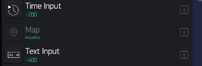
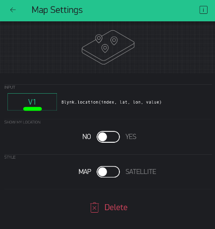

GPS
---

This is useful for tracking things or people or animals remotely.

In Blynk, add a *Map* widget to your dashboard.



Make sure to select a Virtual Pin - say, V1:




You can focus it around Singapore...


## Code GPS Prototype

Start with simple Blynk Blink code...

Then add this before Setup():

```
WidgetMap myMap(V1);
```

This is how you pass information to Blynk's Map from your microcontroller:
myMap.location(**index**, **latitude**, **longitude**, **name of tracked object**);

So you can add this to Setup() just to test:
``` 
myMap.location(0, 1.352800, 103.721820, "trackID1");
```
Putting it all together:

```
#define BLYNK_PRINT Serial
#include <BlynkSimpleEsp32.h>

// See Auth Token in email from Blynk...
char auth[] = "YourAuthToken";

// Your WiFi credentials.
// Set password to "" for open networks.
char ssid[] = "YourNetworkName";
char pass[] = "YourPassword";

WidgetMap myMap(V1);

void setup() {
  // Debug console
  Serial.begin(9600);

  Blynk.begin(auth, ssid, pass, "a9i.sg", 8081);
  myMap.location(0, 1.352800, 103.721820, "trackID1");

}

void loop() {
  Blynk.run();
}
```

## Faking It

Making the GPS electronics work can take a while.  To make sure your concept works, we can fake a moving object by changing the latitude and longitude of a particular ID every second...:

```
#define BLYNK_PRINT Serial
#include <BlynkSimpleEsp32.h>

// See Auth Token in email from Blynk...
char auth[] = "YourAuthToken";

// Your WiFi credentials.
// Set password to "" for open networks.
char ssid[] = "YourNetworkName";
char pass[] = "YourPassword";

// The timer for checking the IR state
BlynkTimer timer;

// The Map Widget API
WidgetMap myMap(V1);

// Keeping track fo GPS Lat/Lon
float lat, lon;

void setup() {
  // Debug console
  Serial.begin(9600);

  Blynk.begin(auth, ssid, pass, "a9i.sg", 8081);
  lat = 1.352800;
  lon = 103.721820;

  // Update every N second (1000 ms = 1 second)
  timer.setInterval(3000L, updateGPS);
}

void updateGPS() {
  // Increase Lat by 0.0001
  lat += 0.0001;

  // Decrease Lon by 0.0001
  lon -= 0.0001;

  // Update Map
  myMap.location(0, lat, lon, "trackID1");
}

void loop() {
  Blynk.run();
  timer.run();
}
```