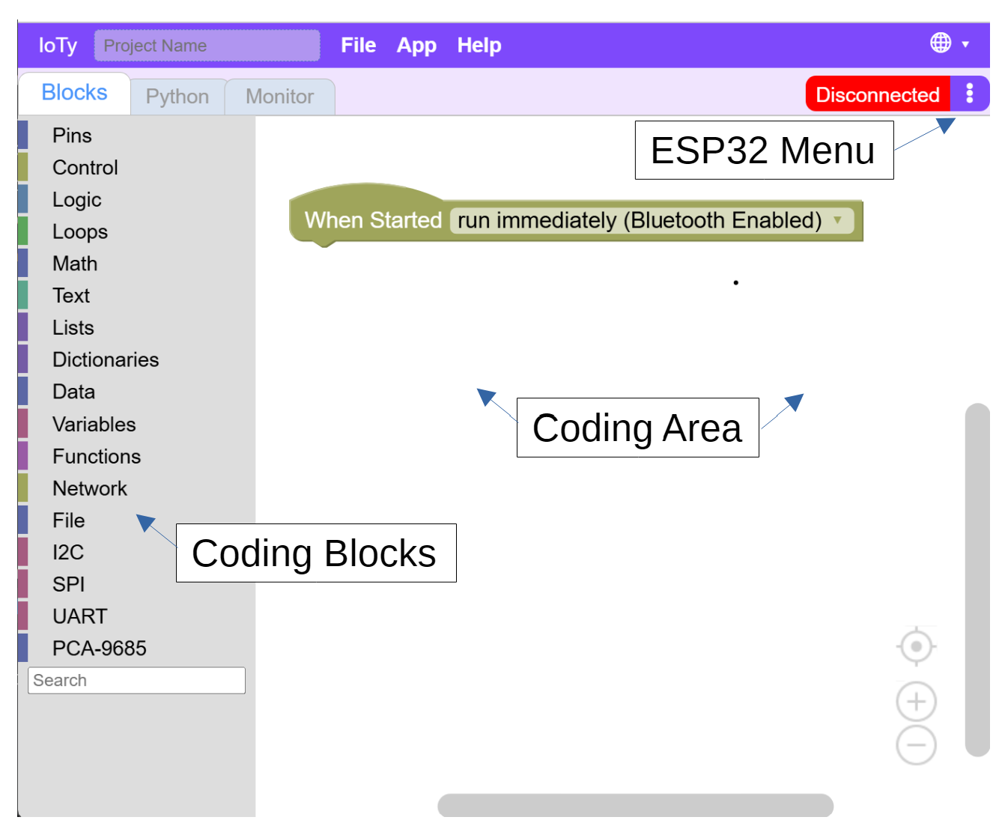
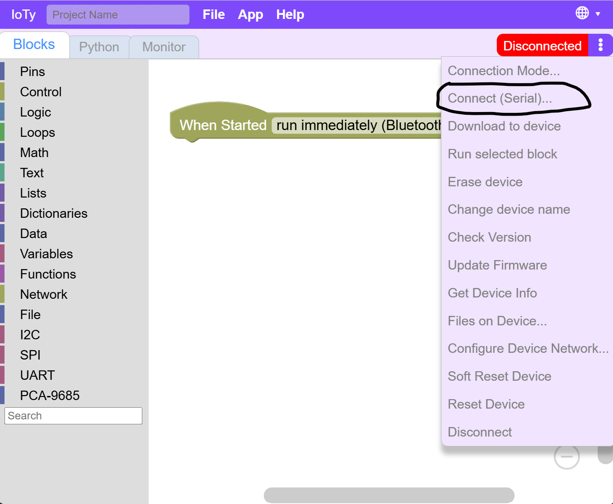
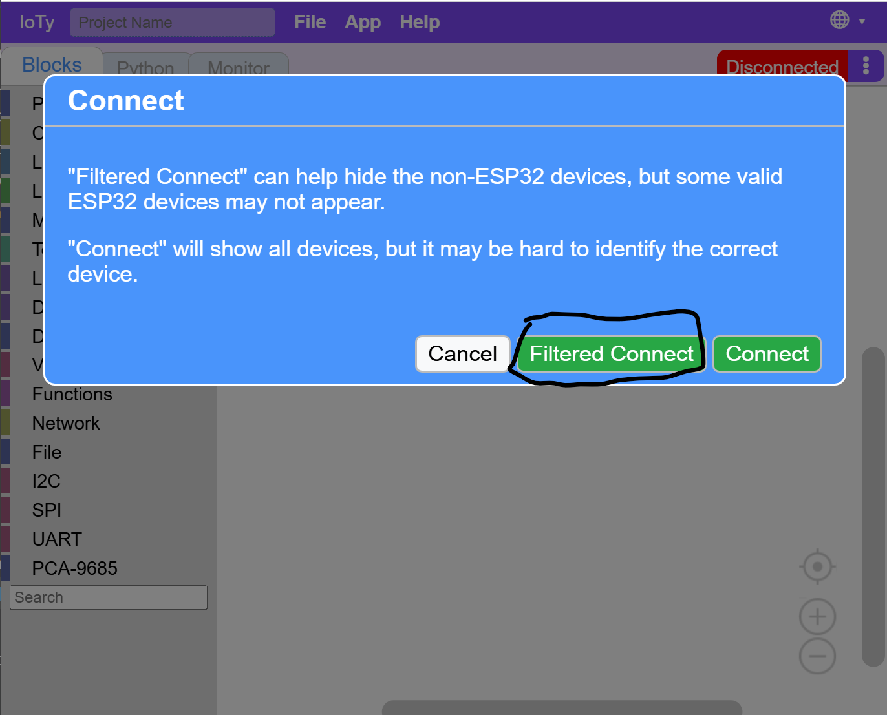
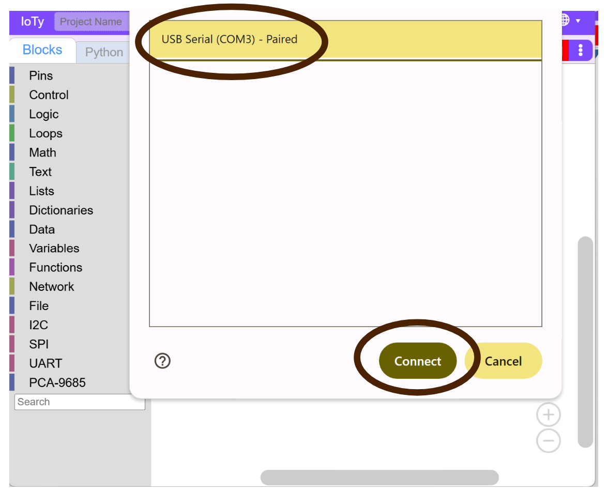
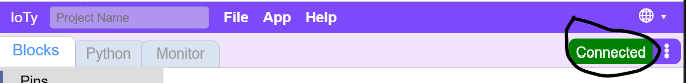

Connecting the ESP32
---

We are going to code the on-board blue light LED just as a way to understand the programming environment we will use with the ESP32.

But first we will need to establish a connection between our ESP32 and the programming environment.

The platform we will be using for our coding and control of the ESP32 board is [A Posteriori's IoTy](http://a9i.sg/ioty) at http://a9i.sg/ioty.

Reminder: You can program the blue light's behavior by controlling the D2/Pin2 on the ESP32.

Make sure your ESP32 is connected to your laptop with teh USB cable.  We will be using Serial Connection to communicate between IoTy platform and the ESP32 board.

Note:  There are other ways to connect using bluetooth and WiFi - we mainly use that when our IoTy platform is running on a mobile PLD like an iPad.

Click on the ESP32 Menu (3 dots) and make sure the connection type is set to Serial.

Then click **Connect (Serial)...**

Click **Filtered Connect** - it will filter out some ports that won't make sense for our platform that can be confusing and only required for advanced use cases.

There should be only one port listed.  Click on it, and then connect.

If there are no ports listed, try to unplug and plug back in your USB - both sides to make sure you have a proper connection.

If successful, the top right connection status area should turn green and say "Connected".

<strong>WARNING:</strong>  Every now and then the connection falls asleep for various reasons like power-saving.  In this case the connected status stays on but the serial connection is no longer stable.  You may see errors like Communication Timeout or the screen freeze with "Entering Raw Mode".

In these cases, you will need to **physically disconnect and reconnect** the USB cable and reconnect in software using the steps outlined above.

