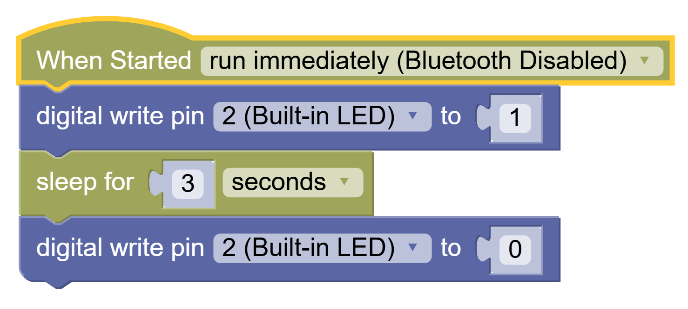
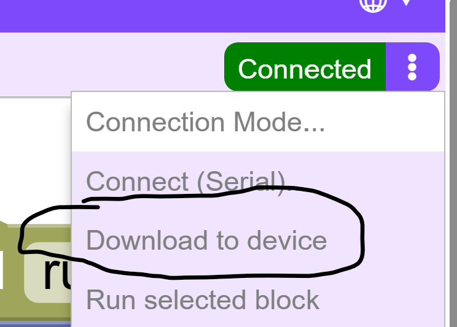
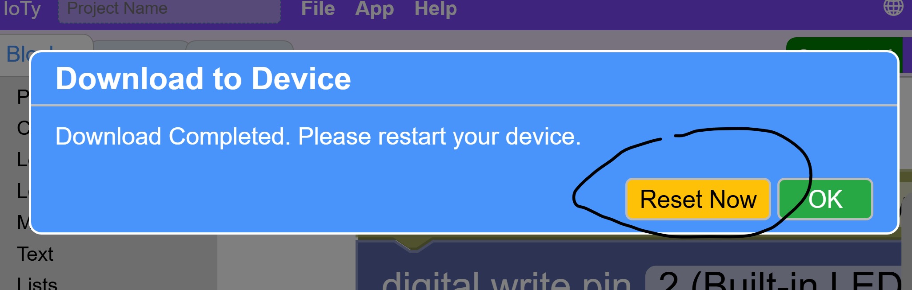

Programming the ESP32
---

We are finally ready to program the blue LED.

The first category of blocks on the left is Pins.

**Digital Read/Write** blocks are for pins you will be using as binary toggles - on/off.  For instance to control a programmable light switch.

Write means you are writing to the pin chosen in order to change its state - 0(off) / 1(on):

This turns on the 2nd pin and the blue LED light it is internally connected to.

Read means you are reading from the pin to check its state.  If we wanted to use the EN button on the right of the ESP32 to control some user event we would Read the state of Pin 0 which the button is internally connected to, like this:

If at some point we need more or different type of physical buttons for our project, we can connect them to other pins and use Digital Read to check their state.

Anyways, right now we just want to exert some programming power over the Blue Light to control its behavior.

For that we only need the Digital Write block, and you can find the Sleep block under the Control categor:

This will turn the Blue LED light on for 3 seconds and then turn it off.

Now Download and Reset the code to the ESP32:

You can also reset using the BOOT/RESET button on the bottom left of the ESP32 to rerun the program.

Finally, there's a reset menu choice as well.

You should see the power cycle and then the light stay on for however long you sleep in your code.

<strong>NOTE:</strong> Remember that the blue LED will always flash 3 times during the start of a power cycle.  Your program will initiate after that.

Blink Challenge
---

Can you make code that blinks the LED 10 times slower or faster than the power cycle 3 blinks?

HINT: Use Loops to simplify code.

HINT 2: Each block happens intantaneously.  In order to maintain the state of the LED on or off for a sustained time that your eye can detect, you must SLEEP.
